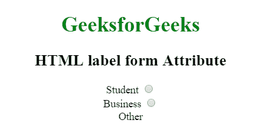

# HTML | label 表单属性

> 原文:[https://www.geeksforgeeks.org/html-label-form-attribute/](https://www.geeksforgeeks.org/html-label-form-attribute/)

**HTML <标签>表单属性**用于指定<标签>元素可以包含一个或多个表单。

**语法:**

```html
<label form="form_id"> 
```

**属性值:**它包含单个值 **form_id** ，该值包含指定一个或多个标签元素所属的 form_id。该属性的值应该是<表单>元素的 id。

**示例:**

```html
<!DOCTYPE html> 
<html> 
    <head> 
        <title> 
            HTML label form Attribute 
        </title> 
    </head> 

    <body style = "text-align:center"> 

        <h1 style = "color:green;"> 
            GeeksforGeeks 
        </h1> 

        <h2> 
            HTML label form Attribute 
        </h2> 

        <form action="#" method="get" id="GFG_form">
            <!-- Starts label tag from here -->
            <label for = "student"> 
                Student 
            </label> 

            <input type = "radio" name = "Occupation"
            id = "student" value = "student"><br> 

            <label for = "business"> 
                Business 
            </label> 

            <input type = "radio" name = "Occupation"
            id = "business" value = "business"><br> 
        </form>

        <label for="other" form="GFG_form">Other</label>
    </body> 

</html>                    
```

**输出:**


**支持的浏览器:**标签>表单属性支持的浏览器如下:

*   谷歌 Chrome
*   微软公司出品的 web 浏览器
*   火狐浏览器
*   旅行队
*   歌剧