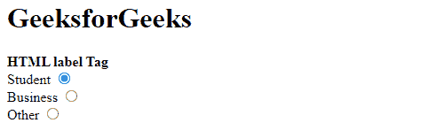
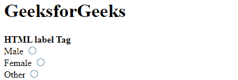

# HTML label 标签

> 哎哎哎:# t0]https://www . geeksforgeeks . org/html 标签/

HTML 中的<label>标签用于为鼠标用户提供可用性改进，即如果用户点击<label>元素内的文本，它将切换控件。<label>标签定义了<button>、<input>、<meter>、

<output>、<progress>、<select>或</select><textarea>元素的标签。</textarea></progress></output></meter></button></label></label></label> 

**<标签>标签有两种使用方式:**

*   首先，通过提供<input>和 id 属性来使用<label>标签。<label>标签需要一个与输入 id 值相同的属性*。*</label></label>
*   或者，<input>标签直接在<label>标签内部使用。在这种情况下，不需要的*和 id 属性，因为关联是隐式的。*</label>

**语法:**

```html
<label> form content... </label>
```

**属性值:**

*   [**代表**](https://www.geeksforgeeks.org/html-label-for-attribute) **:** 是指这个标签代表的输入控件。其值必须与输入控件的“id”属性的值相同。
*   [**形态**](https://www.geeksforgeeks.org/html-label-form-attribute/) **:** 是指标签所属的形态。

**示例 1:** 这里我们将使用级别标签之外的输入标签。

## 超文本标记语言

```html
<!DOCTYPE html>
<html>

<body>

    <h1>GeeksforGeeks</h1>
    <strong>HTML label Tag</strong>

    <form>

        <!-- Starts label tags from here -->
        <label for="student">
                Student
        </label>
        <input type="radio" name="Occupation"
               id="student" value="student"><br>

        <label for="business">
                Business
        </label>
        <input type="radio" name="Occupation"
               id="business" value="business"><br>

        <label for="other">
                Other
        </label>
        <!-- Ends label tags here -->

        <input type="radio" name="Occupation" 
               id="other" value="other">
    </form>
</body>

</html>
```

**输出:**



**示例 2:** 这里我们将使用级别标签内部的输入标签。

## 超文本标记语言

```html
<!DOCTYPE html>
<html>
  <body>
    <h1>GeeksforGeeks</h1>

    <strong>HTML label Tag </strong>

    <form>
      <!-- label tag starts from here -->
      <label>
        Male
        <input type="radio" name="gender" 
               id="male" value="male" />
      </label><br/>

      <label>
        Female
        <input type="radio" name="gender" 
               id="female" value="female" /> 
      </label><br/>

      <label>
        Other
        <input type="radio" name="gender" 
               id="other" value="other" />
      </label>
      <!-- label tag ends from here -->
    </form>
  </body>
</html>
```

**输出:**



**支持的浏览器:**

*   谷歌 Chrome
*   微软公司出品的 web 浏览器
*   火狐浏览器
*   歌剧
*   旅行队