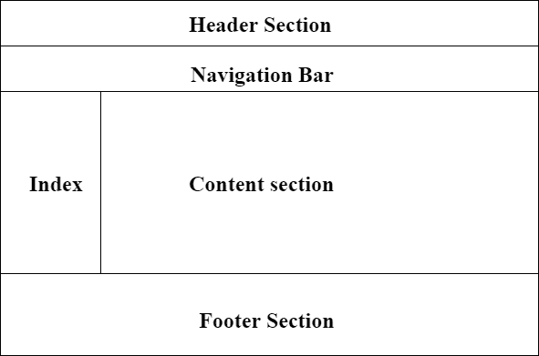
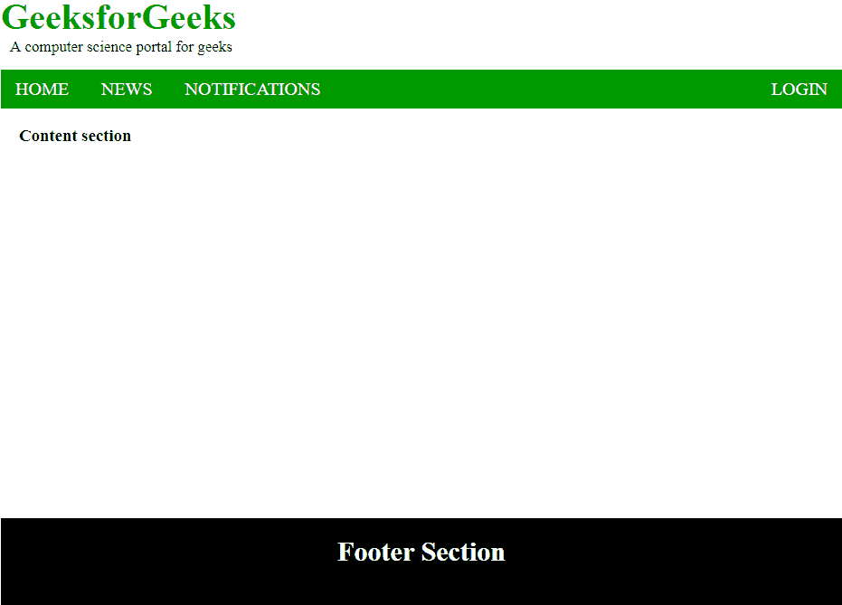

# HTML |布局

> 原文:[https://www.geeksforgeeks.org/html-layout/](https://www.geeksforgeeks.org/html-layout/)

页面布局是平面设计的一部分，处理页面上视觉元素的排列。页面布局用于使网页看起来更好。它建立了图形元素之间的整体外观、相对重要性和关系，以实现信息的流畅流动和眼睛的移动，从而获得最大的效果或影响。



**页面布局信息:**

*   **页眉:**在页面顶部使用的前端部分。<页眉>标签用于在网页中添加页眉部分。
*   **导航栏:**导航栏与菜单列表相同。它用于使用超链接显示内容信息。
*   **索引/侧边栏:**它保存附加信息或广告，并不总是需要添加到页面中。
*   **内容部分:**内容部分是显示内容的主要部分。
*   **页脚:**页脚部分包含联系方式等与网页相关的查询。页脚部分总是放在网页的底部。<页脚>标签用于设置网页中的页脚。

**例:**

## 超文本标记语言

```html
<!DOCTYPE html>
<html>
<head>
    <title>Page Layout</title>
    <style>
        .head1 {
            font-size:40px;
            color:#009900;
            font-weight:bold;
        }
        .head2 {
            font-size:17px;
            margin-left:10px;
            margin-bottom:15px;
        }
        body {
            margin: 0 auto;
            background-position:center;
            background-size: contain;
        }

        .menu {  
            position: sticky;
            top: 0;
            background-color: #009900;
            padding:10px 0px 10px 0px;
            color:white;
            margin: 0 auto;
            overflow: hidden;
        }
        .menu a {
            float: left;
            color: white;
            text-align: center;
            padding: 14px 16px;
            text-decoration: none;
            font-size: 20px;
        }
        .menu-log {
            right: auto;
            float: right;
        }
        footer {
            width: 100%;
            bottom: 0px;
            background-color: #000;
            color: #fff;
            position: absolute;
            padding-top:20px;
            padding-bottom:50px;
            text-align:center;
            font-size:30px;
            font-weight:bold;
        }
        .body_sec {
            margin-left:20px;
        }
    </style>
</head>

<body>

    <!-- Header Section -->
    <header>
        <div class="head1">GeeksforGeeks</div>
        <div class="head2">A computer science portal for geeks</div>
    </header>

    <!-- Menu Navigation Bar -->
    <div class="menu">
        <a href="#home">HOME</a>
        <a href="#news">NEWS</a>
        <a href="#notification">NOTIFICATIONS</a>
        <div class="menu-log">
            <a href="#login">LOGIN</a>
        </div>
    </div>

    <!-- Body section -->
    <div class = "body_sec">
        <section id="Content">
            <h3>Content section</h3>
        </section>
    </div>

    <!-- Footer Section -->
    <footer>Footer Section</footer>
</body>
</html>                   
```

**输出:**



**支持的浏览器:**

*   谷歌 Chrome
*   微软边缘
*   火狐浏览器
*   歌剧
*   旅行队

HTML 是网页的基础，通过构建网站和网络应用程序用于网页开发。您可以通过以下 [HTML 教程](https://www.geeksforgeeks.org/html-tutorials/)和 [HTML 示例](https://www.geeksforgeeks.org/html-examples/)从头开始学习 HTML。

CSS 是网页的基础，通过设计网站和网络应用程序用于网页开发。你可以通过以下 [CSS 教程](https://www.geeksforgeeks.org/css-tutorials/)和 [CSS 示例](https://www.geeksforgeeks.org/css-examples/)从头开始学习 CSS。