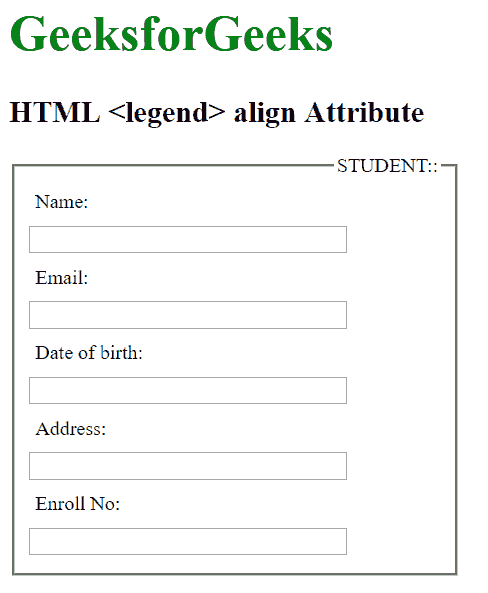

# HTML | legend 对齐属性

> 原文:[https://www.geeksforgeeks.org/html-legend-align-attribute/](https://www.geeksforgeeks.org/html-legend-align-attribute/)

HTML 中的 **<图例>对齐属性**用于指定<字段集>元素中标题的对齐方式。除 Opera 12 及更早版本外，主要浏览器都支持<图例>元素的左右对齐。任何浏览器都不支持底部对齐。
**语法:**

```html
<legend align="left|right|top|bottom">
```

**属性值:**

*   **左侧:**设置元素左侧的标题。
*   **右侧:**设置元素右侧的标题。
*   **顶部:**将标题设置在元素顶部。
*   **底部:**将标题设置在元素底部。

**注意:**HTML 5 不支持<图例>对齐属性。
以下示例说明了 align 属性在<图例>元素中的使用:
**示例:**

## 超文本标记语言

```html
<!DOCTYPE html>
<html>

<head>
    <title>
        HTML legend align Attribute
    </title>

    <style>
        form {
            width: 50%;
        }
        label {
            display: inline-block;
            float: left;
            clear: left;
            width: 90px;
            margin:5px;
            text-align: left;
        }
        input[type="text"] {
            width:250px;
            margin:5px 0px;
        }
        .gfg {
            font-size:40px;
            color:green;
            font-weight:bold;
        }
    </style>
</head>

<body>
    <h1 class = "gfg">
        GeeksforGeeks
    </h1>

    <h2>HTML <legend> align Attribute </h2>

    <form>
        <fieldset>
            <legend align="right">STUDENT::</legend>
            <label>Name:</label> <input type="text"><br>
            <label>Email:</label> <input type="text"><br>
            <label>Date of birth:</label> <input type="text"><br>
            <label>Address:</label> <input type="text"><br>
            <label>Enroll No:</label> <input type="text">
        </fieldset>
    </form>
</body>

</html>
```

**输出:**



**支持的浏览器:**以下是 **HTML <图例>对齐属性**支持的浏览器:

*   谷歌 Chrome
*   微软公司出品的 web 浏览器
*   火狐浏览器
*   旅行队
*   歌剧