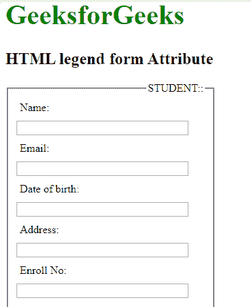

# HTML | legend 表单属性

> 原文:[https://www.geeksforgeeks.org/html-legend-form-attribute/](https://www.geeksforgeeks.org/html-legend-form-attribute/)

**HTML <图例>表单属性**用于指定图例元素所属的一个或多个表单。

**语法:**

```html
<legend form="form_id">
```

**属性值:**

*   **form_id:** 包含指定按钮元素所属的一个或多个的值，即 form_id。该属性的值应该是

    <form>元素的 id。</form>

**示例:**

```html
<!DOCTYPE html>
<html>

<head>
    <title>
        HTML legend form Attribute
    </title>

    <style>
        form {
            width: 50%;
        }

        label {
            display: inline-block;
            float: left;
            clear: left;
            width: 90px;
            margin: 5px;
            text-align: left;
        }

        input[type="text"] {
            width: 250px;
            margin: 5px 0px;
        }

        .gfg {
            font-size: 40px;
            color: green;
            font-weight: bold;
        }
    </style>
</head>

<body>
    <h1 class="gfg"> 
        GeeksforGeeks 
    </h1>

    <h2>HTML legend form Attribute </h2>

    <form>
        <fieldset>
            <legend align="right" 
                    form="myGeeks">
              STUDENT:
          </legend>
            <label>Name:</label>
            <input type="text">
            <br>
            <label>Email:</label>
            <input type="text">
            <br>
            <label>Date of birth:</label>
            <input type="text">
            <br>
            <label>Address:</label>
            <input type="text">
            <br>
            <label>Enroll No:</label>
            <input type="text">
        </fieldset>
    </form>
</body>

</html>
```

**输出:**


**支持的浏览器:**以下是 **HTML <图例>表单属性**支持的浏览器:

*   谷歌 Chrome
*   微软公司出品的 web 浏览器
*   火狐浏览器
*   苹果 Safari
*   歌剧