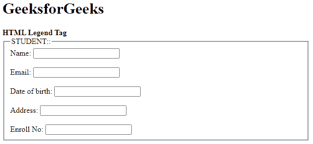

# HTML legend 标签

> 原文:[https://www.geeksforgeeks.org/html-legend-tag/](https://www.geeksforgeeks.org/html-legend-tag/)

图例标记用于定义子内容的标题。图例元素是父元素。该标签用于定义 [<字段集>](https://www.geeksforgeeks.org/html5-fieldset-tag/) 元素的标题。

**语法**

```html
<legend> Text </legend>
```

**例 1:**

## 超文本标记语言

```html
<!DOCTYPE html>
<html>
    <head>
    </head>
    <body>
        <h1>GeeksforGeeks</h1>
        <strong>HTML Legend Tag</strong>
        <form>
            <fieldset>
                <!-- Legend tag useing -->
                <legend>STUDENT::</legend>
                <label>Name:</label>
                <input type="text">
                <br><br>
                <label>Email:</label>
                <input type="text">
                <br><br>
                <label>Date of birth:</label>
                <input type="text">
                <br><br>
                <label>Address:</label>
                <input type="text">
                <br><br>
                <label>Enroll No:</label>
                <input type="text">
            </fieldset>
        </form>
    </body>
</html>
```

**输出:**



**示例 2:** 使用 CSS 属性设置图例标签的样式。

## 超文本标记语言

```html
<!DOCTYPE html>
<html>
    <head>
        <style>
            form{
            width: 50%;
            }
            legend { 
                display: block;
                padding-left: 10px;
                padding-right: 10px;
                border: 3px solid green;
                background-color:tomato;
                color:white;;
            }
            label {
                display: inline-block;
                float: left;
                clear: left;
                width: 90px;
                margin:5px;
                text-align: left;
            }
            input[type="text"] {
                width:250px;
                margin:5px 0px;
            }
            .gfg {
                font-size:40px;
                color:green;
                font-weight:bold;
            }
        </style>
    </head>
    <body>
        <div class = "gfg">GeeksforGeeks</div>
        <h2>HTML Legend Tag</h2>
        <form>
            <fieldset>
                <!-- Legend tag using -->
                <legend>STUDENT:</legend>
                <label>Name:</label>
                <input type="text">
                <br>
                <label>Email:</label>
                <input type="text">
                <br>
                <label>Date of birth:</label>
                <input type="text">
                <br>
                <label>Address:</label>
                <input type="text">
                <br>
                <label>Enroll No:</label>
                <input type="text">
            </fieldset>
        </form>
    </body>
</html>
```

**输出:**


**支持的浏览器:**

*   谷歌 Chrome
*   微软公司出品的 web 浏览器
*   火狐浏览器
*   歌剧
*   旅行队