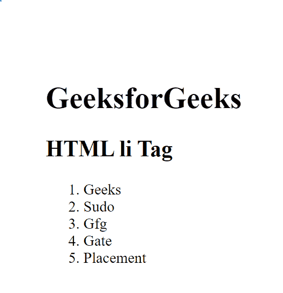
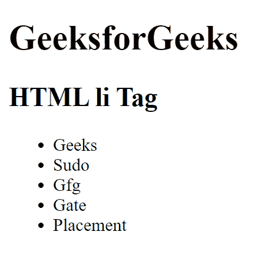
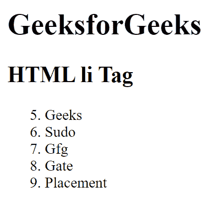

# HTML

*   Tag

    > 原文:[https://www.geeksforgeeks.org/html-li-tag/](https://www.geeksforgeeks.org/html-li-tag/)

    HTML 中的

    *   Tags are used to define list items in HTML documents. It is used for [ordered list < or [T9】 T2 or](https://www.geeksforgeeks.org/html-ol-tag/) [unordered list [T10】 ul > T4\. < li > tag requires a start tag and an end tag.
    **Note:** If the list item is followed by another < Li > element, or if there is no more content in its parent element, the closing tag can be omitted.](https://www.geeksforgeeks.org/html-ul-tag/) 

**语法:**

```html
<li> List Items </li>
```

**属性值:**

[**值:**](https://www.geeksforgeeks.org/html-li-value-attribute/) 值属性用于指定列表项的起始编号。列表项从这个数字开始，并随着每增加一项而增加其值。值属性仅适用于有序列表，即< ol >标签。

**示例 1:** 本示例在有序列表中使用< li >标签。

## 超文本标记语言

```html
<!DOCTYPE html>
<html>

<body>
    <h1>GeeksforGeeks</h1>

    <h2>HTML li Tag</h2>

    <ol>
        <li>Geeks</li>
        <li>Sudo</li>
        <li>Gfg</li>
        <li>Gate</li>
        <li>Placement</li>
    </ol>
</body>

</html>
```

**输出:**



**示例 2:** 本示例使用带有无序列表的< li >标签。

## 超文本标记语言

```html
<!DOCTYPE html>
<html>

<body>
    <h1>GeeksforGeeks</h1>

    <h2>HTML li Tag</h2>

    <ul>
        <li>Geeks</li>
        <li>Sudo</li>
        <li>Gfg</li>
        <li>Gate</li>
        <li>Placement</li>
    </ul>
</body>

</html>
```

**输出:**



**示例 3:** 本示例使用带有值属性的< li >标记来创建列表。

## 超文本标记语言

```html
<!DOCTYPE html>
<html>

<body>
    <h1>GeeksforGeeks</h1>

    <h2>HTML li Tag</h2>

    <ol>
        <li value="5">Geeks</li>
        <li>Sudo</li>
        <li>Gfg</li>
        <li>Gate</li>
        <li>Placement</li>
    </ol>
</body>

</html>
```

**输出:**



**将样式应用于< li >标签:**一些 CSS 属性也可以用来设置< li >元素的样式，这些元素是:[列表样式](https://www.geeksforgeeks.org/css-list-style-property/)、[列表样式图像](https://www.geeksforgeeks.org/css-list-style-image-property/)、[列表样式位置](https://www.geeksforgeeks.org/css-list-style-position-property/)和[列表样式类型](https://www.geeksforgeeks.org/css-list-style-type-property/)。这些属性可以直接应用于< li >元素，尽管它们通常应用于父元素。

**支持的浏览器:**

*   谷歌 Chrome
*   微软公司出品的 web 浏览器
*   火狐浏览器
*   歌剧
*   旅行队