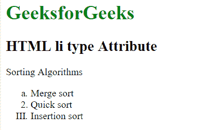
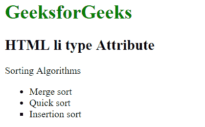

# HTML |

*   type Attribute

    > 原文:[https://www.geeksforgeeks.org/html-li-type-attribute/](https://www.geeksforgeeks.org/html-li-type-attribute/)

    HTML 中的 **< li >类型属性**用于指定列表项的类型。该属性还定义了列表项的项目符号的样式。

    **语法:**

    ```html
    <li type="1|a|A|i|I|disc|circle|square">
    ```

    **属性值:**
    对于有序列表项目:

    *   **1:** 为默认值。它用于指定数字有序列表。
    *   **a:** 用小写字母排列列表项。
    *   **A:** 以大写形式排列列表项。
    *   **i:** 它以小写字母的形式排列罗马数字中的列表项。
    *   **I:** 它以大写字母的形式用罗马数字排列列表。

    对于无序列表项目:

    *   **盘:**为默认值。它会创建一个实心圆。
    *   **圆:**它创建一个未填充的圆。
    *   **正方形:**它创建一个填充的正方形。

    **注意:**HTML 5 不支持< li >类型属性。

    **例 1:**

    ## 超文本标记语言

    ```html
    <!DOCTYPE html>
    <html>

    <head>
        <title>
            HTML li type Attribute
        </title>
    </head>

    <body>

        <h1 style = "color: green;">
            GeeksforGeeks
        </h1>

        <h2>
            HTML list item type Attribute
        </h2>

    <p>Sorting Algorithms</p>

        <ol>
            <li type="a">Merge sort</li>
            <li>Quick sort</li>
            <li type="I">Insertion sort</li>
        </ol>
    </body>

    </html>                   
    ```

    **输出:**

    

    **例 2:**

    ## 超文本标记语言

    ```html
    <!DOCTYPE html>
    <html>

    <head>
        <title>
            HTML li type Attribute
        </title>
    </head>

    <body>

        <h1 style = "color: green;">
            GeeksforGeeks
        </h1>

        <h2>
            HTML li type Attribute
        </h2>

    <p>Sorting Algorithms</p>

        <ul>
            <li>Merge sort</li>
            <li>Quick sort</li>
            <li type="square">Insertion sort</li>
        </ul>
    </body>

    </html>                   
    ```

    **输出:**

    

    **支持的浏览器:**HTML<Li>类型属性支持的浏览器如下:

    *   谷歌 Chrome
    *   微软公司出品的 web 浏览器
    *   火狐浏览器
    *   旅行队
    *   歌剧