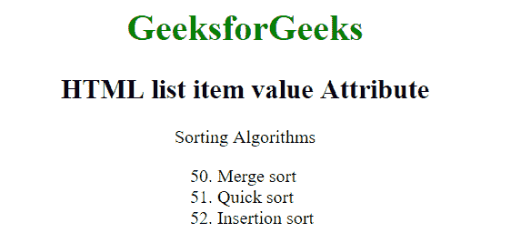
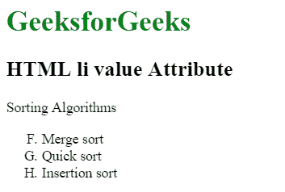

# HTML |

*   value Attribute

    > 原文:[https://www.geeksforgeeks.org/html-li-value-attribute/](https://www.geeksforgeeks.org/html-li-value-attribute/)

    HTML 中的 **< li >值属性**用于指定列表项的初始值。它仅适用于有序列表。

    **语法:**

    ```html
    <li value="number">list items </li>
    ```

    **属性值:**该属性包含单值**号**，用于指定列表项的值。

    **示例 1:** 本示例使用< li >值属性创建项目列表。

    ```html
    <!DOCTYPE html>
    <html>
        <head>
            <title>
                HTML list item value Attribute
            </title>
        </head>

        <body>
            <center>
                <h1 style = "color: green;">
                    GeeksforGeeks
                </h1>

                <h2>
                    HTML list item value Attribute
                </h2>

                <p>Sorting Algorithms</p>
            </center>

            <ol style="margin-left:42%">
                <li value="50">Merge sort</li>
                <li>Quick sort</li>
                <li>Insertion sort</li>
            </ol>

        </body>
    </html>                    
    ```

    **输出:**
    

    **示例 2:** 本示例使用< li >值属性创建项目列表。

    ```html
    <!DOCTYPE html>
    <html>
        <head>
            <title>
                HTML li value Attribute
            </title>
        </head>

        <body>
            <h1 style = "color: green;">
                GeeksforGeeks
            </h1>

            <h2>
                HTML li value Attribute
            </h2>

            <p>Sorting Algorithms</p>

            <ol type = "A">
                <li value="6">Merge sort</li>
                <li>Quick sort</li>
                <li>Insertion sort</li>
            </ol>
        </body>
    </html>                    
    ```

    **输出:**
    

    **支持的浏览器:**Li>值属性支持的浏览器如下:

    *   苹果 Safari
    *   谷歌 Chrome
    *   火狐浏览器
    *   歌剧
    *   微软公司出品的 web 浏览器