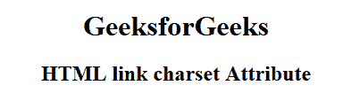

# HTML | <link>字符集属性

> 原文:[https://www.geeksforgeeks.org/html-link-charset-attribute/](https://www.geeksforgeeks.org/html-link-charset-attribute/)

**HTML <链接>字符集属性**用于*指定 HTML 链接文档*的字符编码。使用任何元素的 lang 属性都可以重写 charset 属性。HTML 5 不支持。

**语法:**

```html
<link charset="character_set">
```

**属性值:**它包含单值字符集，用于指定 HTML 文档的字符编码。字符集的值是:

*   **UTF-8:** 指定 Unicode 的字符编码。
*   **ISO-8859-1:** 它规定了拉丁字母的字符编码。

**示例:**

```html
<!DOCTYPE html> 
<html> 

<head> 
    <title> 
        HTML link charset Attribute 
    </title>
</head> 

<body style="text-align:center"> 
    <H1>GeeksforGeeks</H1> 

    <h2>HTML link charset Attribute</h2> 

    <link href="gfg.html" charset="ISO-8859-1"> 
</body> 

</html> 
```

**输出:**


**支持的浏览器:**以下是 **HTML <链接>字符集属性**支持的浏览器:

*   谷歌浏览器:不支持
*   互联网浏览器:不支持
*   火狐:不支持
*   Safari:不支持
*   歌剧:不支持