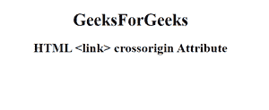

# HTML <link>跨原点属性

> 原文:[https://www . geesforgeks . org/html-link-cross origin-attribute/](https://www.geeksforgeeks.org/html-link-crossorigin-attribute/)

<链接> 元素中的**跨源属性**用于指定从第三方服务器获取或加载样式表或图标文件时支持 HTTP CORS 请求。

**语法:**

```html
<link crossorigin="anonymous | use-credentials">
```

**属性值:**

*   **匿名:**有默认值。它定义了在不传递凭据信息的情况下发送 CORS 请求。
*   **使用-凭证**:跨来源请求将与凭证、cookies 和证书一起发送。

**示例:**下面的代码演示了**跨原点属性**与<链接>元素的使用。

## 超文本标记语言

```html
<!DOCTYPE html>
<html>

<head>
    <link id="linkid" rel="stylesheet" 
        type="text/css" href="styles.css" 
        sizes="16*16" hreflang="en-us"
        crossorigin="anonymous">
</head>

<body style="text-align:center;">
    <h1>GeeksForGeeks</h1>
    <h2>HTML <link>
        crossorigin Attribute
    </h2>
</body>

</html>
```

**输出:**



**支持的浏览器:**

*   谷歌 Chrome 30.0
*   Firefox 13.0
*   Internet Explorer 18.0
*   Opera 12.0
*   Safari 1.0