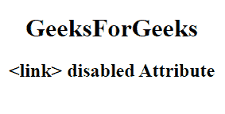

# HTML <link>禁用属性

> 原文:[https://www.geeksforgeeks.org/html-link-disabled-attribute/](https://www.geeksforgeeks.org/html-link-disabled-attribute/)

HTML 中<链接>元素的**禁用**属性用于指定链接文档被禁用。禁用的链接不可点击且不可用。它是一个布尔属性。

**语法**:

```html
<link disabled> ----- </link>
```

**例**:

## 超文本标记语言

```html
<!DOCTYPE html>
<html>

<head>
    <link id="linkid"
        rel="stylesheet"
        type="text/css"
        href="styles.css"
        sizes="16*16"
        hreflang="en-us" disabled>
</head>

<body style="text-align:center;">
    <h1>GeeksForGeeks</h1>
    <h2><link> disabled Attribute</h2>

</body>

</html>   
```

**输出:**



**支持的浏览器:**

*   谷歌 Chrome
*   微软公司出品的 web 浏览器
*   火狐浏览器
*   苹果 Safari
*   歌剧