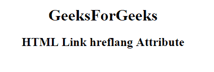

# HTML | <link> hreflang 属性

> 原文:[https://www.geeksforgeeks.org/html-link-hreflang-attribute/](https://www.geeksforgeeks.org/html-link-hreflang-attribute/)

**HTML 链接 hreflang 属性**用于指定链接文档的语言。它仅在设置了 href 属性时使用。

**语法:**

```html
<link hreflang="langauge_code">
```

**属性值:**包含指定链接文档语言代码的值，即语言代码。

**示例:**此示例说明了 hreflang 属性在 Link Element 中的使用。

```html
<!DOCTYPE html>
<html>

<head>
    <link id="linkid" 
          rel="stylesheet" 
          type="text/css" 
          href="styles.css" 
          sizes="16*16" 
          hreflang="en-us">
</head>

<body style="text-align:center;">
    <h1>GeeksForGeeks</h1>
    <h2> 
    HTML Link hreflang Attribute 
</h2>

</body>

</html>
```

**输出:**


**支持的浏览器:****HTML 链接 hreflang 属性**支持的浏览器如下:

*   谷歌 Chrome
*   微软公司出品的 web 浏览器
*   火狐浏览器
*   苹果 Safari
*   歌剧