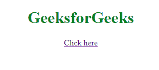

# HTML | <link>媒体属性

> 原文:[https://www.geeksforgeeks.org/html-link-media-attribute/](https://www.geeksforgeeks.org/html-link-media-attribute/)

HTML 链接媒体属性用于指定目标资源优化的媒体/设备。此属性用于为不同的媒体类型指定不同的样式。
媒体属性可以接受多个值。

**语法:**

```html
<link media="value">
```

**可能的操作员:**

| 价值 | 描述 |
| 和 | 逻辑积算符 |
| 不 | “非”算符 |
| , | 或运算符 |

**设备:**

| 价值 | 描述 |
| 全部 | 适用于所有设备 |
| 耳的 | 语音合成器 |
| 盲文 | 盲文反馈设备 |
| 手持类型的 | 手持设备(小屏幕，有限带宽) |
| 推断 | 放映机 |
| 打印 | 打印预览模式/打印页面 |
| 屏幕 | 电脑屏幕 |
| 电传打字机 | 使用固定间距字符网格的电传打字机和类似媒体 |
| 电视 | 低分辨率或滚动能力有限的设备，如电视。 |

**值:**

| 价值 | 描述 |
| 宽度 | 目标显示区域的宽度。 |
| 高度 | 目标显示区域的高度 |
| 设备宽度 | 目标显示或纸张宽度。 |
| 设备高度 | 目标显示或纸张高度。 |
| 方向 | 目标显示或纸张方向。 |
| 纵横比 | 目标显示区域的宽高比。 |
| 设备纵横比 | 目标显示器/纸张的设备宽度/设备高度比。 |
| 颜色 | 目标显示器每种颜色的位数。 |
| 颜色指数 | 目标显示器可以处理的颜色数量。 |
| 黑白的 | 单色帧缓冲区中的每像素位数。 |
| 解决 | 目标显示器/纸张的像素密度(dpi 或 dpcm)。 |
| 扫描 | 电视显示器的扫描方法。 |
| 格子 | 如果输出设备是网格或位图。 |

**注意:**可以使用**“min-****“max-**等前缀。

**示例:**

```html
<!DOCTYPE html>
<html>

<head>
    <link rel="stylesheet" 
          type="text/css" 
          href="index_screen.css">

    <link rel="stylesheet" 
          type="text/css"
          href="index_print.css" 
          media="print">
</head>

<body>
    <center>
        <h1>GeeksforGeeks</h1>
        <p><a href="index.html" target="_blank">
      Click here
      </a>
    </center>
</body>

</html>
```

**输出:**


**支持的浏览器:****HTML 链接媒体属性**支持的浏览器如下:

*   谷歌 Chrome
*   微软公司出品的 web 浏览器
*   火狐浏览器
*   苹果 Safari
*   歌剧