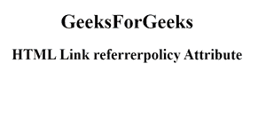

# HTML <link>引用者策略属性

> 原文:[https://www . geesforgeks . org/html-link-referer policy-attribute/](https://www.geeksforgeeks.org/html-link-referrerpolicy-attribute/)

**HTML <链接> referrerpolicy 属性**用于指定在取出资源时将发送到服务器的引用信息。

**语法:**

```html
<link referrerpolicy="value">
```

**属性值:**

*   **无引用者**:指定不会随请求一起发送引用信息。
*   **降级时无推荐人:**有默认值。它指定引用头将不会发送到没有 HTTPS 的源。
*   **来源:**指定在所有情况下只发送文档的来源作为推荐人。
*   **原点-当-跨原点:**执行同原点请求时发送原点、路径、查询字符串，其他情况只发送单据的原点。
*   **unsafe-url:** 发送来源、路径和查询字符串，但不包括片段、密码和用户名。

**示例:**下面的代码说明了<链接>引用者策略属性的使用，我们已经将引用者策略属性设置为无引用者。

## 超文本标记语言

```html
<!DOCTYPE html>
<html>

<head>
    <link id="linkid"
        rel="stylesheet"
        type="text/css"
        href="styles.css"
        sizes="16*16"
        hreflang="en-us" 
        referrerpolicy="no-referrer">
</head>

<body style="text-align:center;">
    <h1>GeeksForGeeks</h1>

    <h2>
        HTML Link referrerpolicy Attribute
    </h2>
</body>

</html>
```

**输出:**



**支持的浏览器:**

*   谷歌 Chrome
*   微软公司出品的 web 浏览器
*   火狐浏览器
*   苹果 Safari
*   歌剧