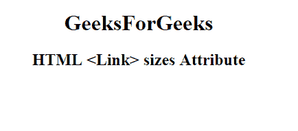

# HTML | <link>大小属性

> 原文:[https://www.geeksforgeeks.org/html-link-sizes-attribute/](https://www.geeksforgeeks.org/html-link-sizes-attribute/)

**HTML 链接大小属性**用于指定视觉媒体的图标大小，仅在 *rel="icon"* 时有效。它是只读属性。

**语法:**

```html
<link sizes="HeightxWidth | any">
```

**属性值**

*   **HeightxWidth** It is used to specify the one or more sizes of a linked icon. The value of the height and the width are separated by an *“x”* or *“X”*.

    **例如:**

    1.  <link rel="”icon”" href="”geeks.png”" sizes="”16×16″" type="”image/png”"> (1 个尺寸)
    2.  <link rel="”icon”" href="”sudo.png”" sizes="”16×16" type="”image/png”"> (2 种尺寸)
*   **任意:**指定图标是可缩放的(像 SVG 图像)。
    **示例:**<link rel = " icon " href = " icon . SVG " size = " any " type = " image/SVG+XML ">(任意大小)。

**示例:**

```html
<!DOCTYPE html>
<html>

<head>
    <link id="linkid"
          rel="stylesheet" 
          type="text/css"
          href="styles.css" 
          sizes="16*16">
</head>

<body style="text-align:center;">
    <h1>GeeksForGeeks</h1>
    <h2>HTML <Link> sizes Attribute</h2>
</body>

</html>
```

**输出:**


**支持的浏览器:**HTML<链接>不支持的浏览器大小属性。