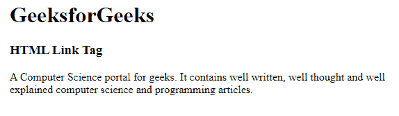
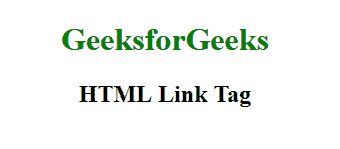

# HTML <link>标签

> 原文:[https://www.geeksforgeeks.org/html-link-tag/](https://www.geeksforgeeks.org/html-link-tag/)

**示例:**在本例中，我们使用了<链接>标签&在 HTML 中声明了标签内部的 *rel* 属性& *类型*属性。

## 超文本标记语言

```html
<!DOCTYPE html>
<html>
<head>
    <link rel="stylesheet" 
          type="text/css" 
          href="style.css">
</head>

<body>
    <h1>GeeksforGeeks</h1>
    <h3>HTML Link Tag</h3>
    <p> 
        A Computer Science portal for geeks. 
        It contains well written, well thought 
        and well explained computer science and 
        programming articles. 
    </p>

</body>
</html>
```

**输出:**



链接标签用于定义文档和外部资源之间的链接。链接标签主要用于链接到外部样式表。这个元素可以出现多次，但它只出现在头部。链接元素是空的，它只包含属性。link 元素中的值表示被链接到&的项与包含文档的关系。

**语法:**

```html
 <link rel="stylesheet" type="text/css" href="styles.css">
```

**属性值:**

*   [](https://www.geeksforgeeks.org/html-link-charset-attribute/)**:用于指定 HTML 链接文档的字符编码。**
*   ****crossOrigin** :指定链接文档的 CORS 设置。**
*   **[**禁用**](https://www.geeksforgeeks.org/html-link-disabled-attribute/) :用于指定链接单据禁用。**
*   **[**href**](https://www.geeksforgeeks.org/html-link-href-attribute/) :用于指定链接文档的网址。**
*   **[](https://www.geeksforgeeks.org/html-link-hreflang-attribute/)**:用于指定链接文档的语言。****
*   ****[**媒体**](https://www.geeksforgeeks.org/html-link-media-attribute/) :用于指定目标资源优化的媒体/设备。****
*   ****[**rel**](https://www.geeksforgeeks.org/html-link-rel-attribute/) :用于指定当前与链接单据的关系。****
*   ******rev** :将链接单据的反向关系赋给当前单据。****
*   ****[**尺寸**](https://www.geeksforgeeks.org/html-link-sizes-attribute/) :用于指定视觉媒体的图标尺寸，仅在 rel =“icon”时有效。****
*   ****[**目标**](https://www.geeksforgeeks.org/html-link-target-attribute/) **:用于指定加载链接文档的窗口或框架。******
*   ******类型**:用于设置/返回链接文档的内容类型。****

******示例:**在本例中，我们使用了 *hreflang* 属性，其值设置为“ *en-us* ，该属性将指定链接文档的语言。我们正在链接一个外部 CSS 文件，其中包含 h1 标签的颜色属性，该属性设置为绿色。****

## ****超文本标记语言****

```html
**<!DOCTYPE html>
<html>
<head>
    <title>HTML Link Tag</title>
    <link rel="stylesheet" 
          type="text/css" 
          href="style.css"
          hreflang="en-us"> 
</head>

<body>
    <h1>GeeksforGeeks</h1>
    <h2>HTML Link Tag</h2> 
</body>
</html>**
```

******输出:******

********

******支持的浏览器:******

*   ****谷歌 Chrome 93.0 及以上****
*   ****Internet Explorer 11.0****
*   ****微软边缘 93.0****
*   ****火狐 92.0 及以上版本****
*   ****Safari 14.1****
*   ****Opera 79.0****