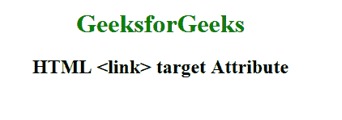

# HTML | <link>目标属性

> 原文:[https://www.geeksforgeeks.org/html-link-target-attribute/](https://www.geeksforgeeks.org/html-link-target-attribute/)

HTML <link>目标属性用于指定加载链接文档的窗口或框架。HTML 5 不支持。

**语法:**

```html
<link target="_blank|_self|_parent|_top|framename">
```

**属性值:**

*   **_blank:** 在新窗口打开链接。
*   **_self:** 在同一框架中打开链接的文档。
*   **_parent:** 打开父框架集中的链接文档。
*   **_top:** 在窗口的整个正文中打开链接的文档。
*   **框架名称:**在命名框架中打开链接文档。

**示例:**

```html
<!DOCTYPE html> 
<html>

<head>
    <title>
        HTML link target Attribute
    </title>
</head>

<body> 
    <center> 
        <h1 style="color:green;"> 
            GeeksforGeeks 
        </h1> 

        <h2> 
            HTML <link> target Attribute
        </h2> 

        <link href="geeksforgeeks.org" target="_blank">
    </center> 
</body> 

</html> 
```

**输出:**


**支持的浏览器:**HTML<链接>目标属性不被任何浏览器支持。