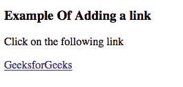
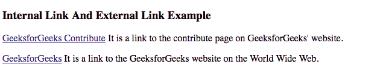

# HTML |链接

> 原文:[https://www.geeksforgeeks.org/html-links/](https://www.geeksforgeeks.org/html-links/)

**什么是链接？**

它是从一个 web 资源到另一个 web 资源的连接。链接有两端，锚和方向。链接从“源”锚点开始，指向“目标”锚点，该锚点可以是任何网络资源，如图像、视频剪辑、声音片段、程序、HTML 文档或 HTML 文档中的元素。

**HTML 链接语法**

使用“a”标记在 HTML 中指定链接。


**语法解释:**

```html
href : The href attribute is used to specify 
the destination address of the link used.
Text link : The text link 
is the visible part of the link.
```

**输入:**

## 超文本标记语言

```html
<!DOCTYPE html>
<html>
 <h3>Example Of Adding a link</h3>
   <body>

<p>Click on the following link</p>

      <a href = "https://www.geeksforgeeks.org">GeeksforGeeks</a>
   </body>

</html>
```

**输出:**



**内部链接**

内部链接是一种超链接类型，其目标或目的地是同一网站或域上的资源，如图像或文档。
**输入:**

## 超文本标记语言

```html
<!DOCTYPE html>
<html>
<h3>Internal Link And External Link Example</h3>
<body>

<p><a href="html_contribute.asp/">GeeksforGeeks Contribute
</a> It is a link to the contribute page on GeeksforGeeks' website.</p>

<p><a href="https://www.geeksforgeeks.org">GeeksforGeeks
</a> It is a link to the GeeksforGeeks website on the World Wide Web.</p>

</body>
</html>
```

**输出:**



<video class="wp-video-shortcode" id="video-166467-1" width="640" height="360" preload="metadata" controls=""><source type="video/mp4" src="https://media.geeksforgeeks.org/wp-content/uploads/links.mp4?_=1">[https://media.geeksforgeeks.org/wp-content/uploads/links.mp4](https://media.geeksforgeeks.org/wp-content/uploads/links.mp4)</video>

**在 HTML 中更改链接颜色**

不同类型的链接以不同的格式出现，如:

1.  默认情况下，未访问的链接显示为下划线和蓝色。
2.  默认情况下，已访问的链接显示为下划线和紫色。
3.  默认情况下，活动链接显示为下划线和红色。

使用 CSS 可以改变链接的外观。
**输入:**

## 超文本标记语言

```html
<!DOCTYPE html>
<html>
<head>
<style>
a:link {
    color: red;
    background-color: transparent;
}
a:visited {
    color: green;
    background-color: transparent;
}
a:hover {
    color: blue;
    background-color: transparent;
}
a:active {
    color: yellow;
    background-color: transparent;
}
</style>
</head>
<body>

<p>Changing the default colors of links</p>

<p>Visited Link</p>

<a href="https://www.geeksforgeeks.org">GeeksforGeeks</a>

<p>Link</p>

<a href="https://facebook.com">facebook</a>

<p>hovering effect</p>

<a href="https://www.geeksforgeeks.org">GeeksforGeeks</a>

</body>
</html>
```