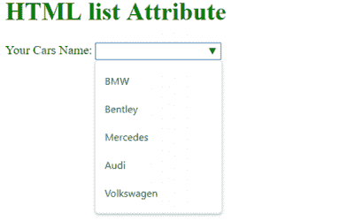
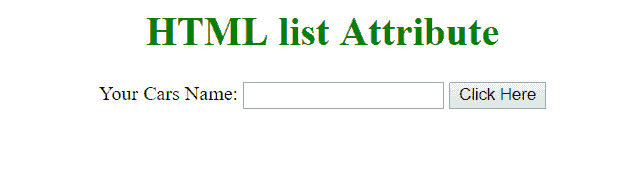
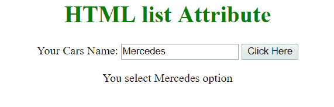

# HTML |列表属性

> 原文:[https://www.geeksforgeeks.org/html-list-attribute/](https://www.geeksforgeeks.org/html-list-attribute/)

HTML 中的**列表属性**用于识别<输入>元素的预定义选项列表，以向用户提供建议。
**用法:**该属性由 [<输入](https://www.geeksforgeeks.org/html-input-list-attribute/?ref=rp) >元素使用。

**语法:**

```html
<input list="name">
```

其中，**名称**是一个字符串，用作 id，用于将<输入>元素与<数据列表>元素链接起来。
以下程序说明了*列表*属性:

**属性值:**

*   **datalist_id:** 用于指定将用于与输入元素建立链接的 datalist 的 id。
    **程序 1:**

## 超文本标记语言

```html
<!DOCTYPE html>
<html>
    <head>
        <title>HTML list Attribute</title>
    </head>

    <body>
        <h1 style = "color:green">HTML list Attribute</h1>

        <form action="">
            <label>Your Cars Name: </label>
            <input list="cars">
            <datalist id="cars">
                <option value="BMW"/>
                <option value="Bentley"/>
                <option value="Mercedes"/>
                <option value="Audi"/>
                <option value="Volkswagen"/>
            </datalist>
        </form>
    </body>
</html>                   
```

**输出:**



**节目 2:**

## 超文本标记语言

```html
<!DOCTYPE html>
<html>
    <head>
        <title>Datalist Tag</title>
    </head>

    <body style = "text-align:center">
        <h1 style = "color:green">HTML list Attribute</h1>

        <form action="">
            <label>Your Cars Name: </label>
            <input list="cars" id="carsInput">
            <datalist id="cars">
                <option value="BMW"/>
                <option value="Bentley"/>
                <option value="Mercedes"/>
                <option value="Audi"/>
                <option value="Volkswagen"/>
            </datalist>

            <button onclick="geek()" type="button">
                Click Here
            </button>
        </form>

        <p id="output"></p>

        <script type="text/javascript">
            function geek(){
                var o1 = document.getElementById("carsInput").value;

                document.getElementById("output").innerHTML = "You select "
                    + o1 + " option";
            }
        </script>
    </body>
</html>                   
```

**输出:**
**点击按钮前:**



**点击按钮后:**



**支持的浏览器:**列表属性支持的浏览器如下:

*   谷歌 Chrome 20.0
*   Internet Explorer 10.0
*   Firefox 4.0
*   歌剧 9.6