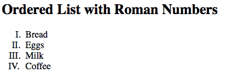

# HTML 列表

> 原文:[https://www.geeksforgeeks.org/html-lists/](https://www.geeksforgeeks.org/html-lists/)

在本文中，我们将通过示例了解 **HTML 列表**，以及了解其类型、实现它们的各种方法。

列表是相关信息的简短片段的记录，或者用于以有序或无序的形式显示网页中的数据或任何信息。例如，为了购买物品，我们需要准备一个可以是有序列表也可以是无序列表的列表，这有助于我们组织数据&容易找到物品。可以与有序的&无序列表一起使用的各种类型的属性请参考 [HTML < li >类型属性](https://www.geeksforgeeks.org/html-li-type-attribute/)一文。

**示例:**下面的示例说明了 HTML 中无序的&有序列表的使用。

## 超文本标记语言

```html
<!DOCTYPE html>
<html>

<head>
    <title>GeeksforGeeks</title>
</head>

<body>
    <h2>Welcome To GeeksforGeeks Learning</h2>
    <h5>List of available courses</h5>
    <ul>
        <li>Data Structures & Algorithm</li>
        <li>Web Technology</li>
        <li>Aptitude & Logical Reasoning</li>
        <li>Programming Languages</li>
    </ul>
    <h5>Data Structures topics</h5>
    <ol>
        <li>Array</li>
        <li>Linked List</li>
        <li>Stacks</li>
        <li>Queues</li>
        <li>Trees</li>
        <li>Graphs</li>
    </ol>
</body>

</html>
```

**输出:**


超文本标记语言列表

**支持的标签:**这些标签在 HTML 列表中使用。

*   html<ul>标记
*   [HTML < ol >标签](https://www.geeksforgeeks.org/html-ol-tag/)
*   html<dl>标签

**HTML 无序列表:**无序列表以“ul”标签开头。每个列表项都以“ [li](https://www.geeksforgeeks.org/html-li-tag/) 标记开头。默认情况下，列表项目用项目符号(即黑色小圆圈)标记。

**语法:**

```html
<ul> list of items </ul>
```

**属性:**该标签包含以下两个属性:

*   [](https://www.geeksforgeeks.org/html-ul-compact-attribute/#:~:text=The%20HTML%20%7C%20compact,It%20is%20a%20Boolean%20attribute.)****:**会让列表变小。**
*   **[**类型**](https://www.geeksforgeeks.org/html-ul-type-attribute/) **:** 指定列表中使用哪种标记。**

****注意:**html 5 不支持< ul >属性。**

****示例:**这个示例描述了无序列表。**

## **超文本标记语言**

```html
<!DOCTYPE html>
<html>

<body>
    <h2>Grocery list</h2>
    <ul>
        <li>Bread</li>
        <li>Eggs</li>
        <li>Milk</li>
        <li>Coffee</li>
    </ul>
</body>

</html>
```

****输出:****

**

无序列表** 

****HTML 无序列表有各种列表项标记:****

****示例 1:** 光盘可用于将列表项标记设置为项目符号，即默认。**

## **超文本标记语言**

```html
<!DOCTYPE html>
<html>

<head>
    <title>HTML ul tag</title>
</head>

<body>
    <h1>GeeksforGeeks</h1>
    <h2>Unordered List with Disc Bullets</h2>
    <p>GeeksforGeeks courses List:</p>

    <ul style="list-style-type:disc">
        <li>Geeks</li>
        <li>Sudo</li>
        <li>Gfg</li>
        <li>Gate</li>
        <li>Placement</li>
    </ul>
</body>

</html>
```

****输出:****

**

带有光盘项目制作机的无序列表** 

****示例 2:** 圆形可用于将列表项标记设置为圆形。**

## **超文本标记语言**

```html
<!DOCTYPE html>
<html>

<body>
    <h1>GeeksforGeeks</h1>
    <h2>Unordered List with Circle Bullets</h2>
    <p>GeeksforGeeks courses List:</p>

    <ul style="list-style-type: circle">
        <li>Geeks</li>
        <li>Sudo</li>
        <li>Gfg</li>
        <li>Gate</li>
        <li>Placement</li>
    </ul>
</body>

</html>
```

****输出:****

**

带有圆形项目生成器的无序列表** 

****例 3:** 方块可用于将列表项标记设置为方块。**

## **超文本标记语言**

```html
<!DOCTYPE html>
<html>

<body>
    <h1>GeeksforGeeks</h1>
    <h2>Unordered List with Square Bullets</h2>
    <p>GeeksforGeeks courses List:</p>

    <ul style="list-style-type: square">
        <li>Geeks</li>
        <li>Sudo</li>
        <li>Gfg</li>
        <li>Gate</li>
        <li>Placement</li>
    </ul>
</body>

</html>
```

****输出:****

**

带有方形项目生成器的无序列表** 

****例 4:** 没有可以用来设置没有标记的列表项标记。**

## **超文本标记语言**

```html
<!DOCTYPE html>
<html>

<body>
    <h1>GeeksforGeeks</h1>
    <h2>Unordered List with No Bullets</h2>
    <p>GeeksforGeeks courses List:</p>

    <ul style="list-style-type: none">
        <li>Geeks</li>
        <li>Sudo</li>
        <li>Gfg</li>
        <li>Gate</li>
        <li>Placement</li>
    </ul>
</body>

</html>
```

****输出:****

**

无项目制造商的无序列表** 

****示例:**嵌套无序列表，用于嵌套列表项即。，在另一个列表中列出。**

## **超文本标记语言**

```html
<!DOCTYPE html>
<html>

<body>
    <h1>GeeksforGeeks</h1>
    <h2>Nested Unordered List</h2>
    <p>GeeksforGeeks courses List:</p>

    <ul>
        <li>DSA</li>
        <ul>
            <li>Array</li>
            <li>Linked List</li>
            <li>stack</li>
            <li>Queue</li>
        </ul>
        <li>Web Technologies</li>
        <ul>
            <li>HTML</li>
            <li>CSS</li>
            <li>JavaScript</li>
        </ul>
        <li>Aptitude</li>
        <li>Gate</li>
        <li>Placement</li>
    </ul>
</body>

</html>
```

****输出:****

**

嵌套无序列表** 

****HTML 有序列表:**有序列表以“ol”标签开头。每个列表项都以“li”标记开始。默认情况下，列表项用数字标记。**

****语法:****

```html
<ol>
   <li>Item1</li>
   <li>Item2</li>
   <li>Item3</li>
</ol>
```

****属性:****

*   **[**【紧凑】**](https://www.geeksforgeeks.org/html-ol-compact-attribute/) **:** 它定义了应该紧凑的列表(紧凑属性不支持 HTML5。用 CSS 代替。).**
*   **[**反转**](https://www.geeksforgeeks.org/html-ol-reversed-attribute/) **:定义顺序为降序。****
*   **[**开始**](https://www.geeksforgeeks.org/html-ol-start-attribute/) **:** 定义顺序从哪个数字或字母开始。**
*   **[**类型**](https://www.geeksforgeeks.org/html-ol-type-attribute/) **:** 它定义了您想要的数字、字母或罗马数字列表中的顺序类型(1、A、A、I 和 I)。**

****示例**:本示例说明了反向属性的使用，控制列表计数&类型属性。**

## **超文本标记语言**

```html
<!DOCTYPE html>
<html>

<head>
    <title>HTML ol tag</title>
</head>

<body>
    <h1 style="color: green">GeeksforGeeks</h1>
    <h3>HTML ol tag</h3>
    <p>reversed attribute</p>

    <ol reversed>
        <li>HTML</li>
        <li>CSS</li>
        <li>JS</li>
    </ol>
    <p>start attribute</p>

    <ol start="5">
        <li>HTML</li>
        <li>CSS</li>
        <li>JS</li>
    </ol>
    <p>type attribute</p>

    <ol type="i">
        <li>HTML</li>
        <li>CSS</li>
        <li>JS</li>
    </ol>
</body>

</html>
```

****输出:****

**

不同列表样式的有序列表** 

****HTML 有序列表有各种列表项标记**:<ol>标签的类型属性定义了列表项标记的类型。**

****例 1** :列表项会用数字编号，即默认。**

## **超文本标记语言**

```html
<!DOCTYPE html>
<html>

<body>
    <h2>Ordered List with Numbers</h2>
    <ol type="1">
        <li>Bread</li>
        <li>Eggs</li>
        <li>Milk</li>
        <li>Coffee</li>
    </ol>
</body>

</html>
```

****输出:****

**

带数字项目制造商的订购列表** 

****例 2** : Type="A "，该列表项将用大写字母编号。**

## **超文本标记语言**

```html
<!DOCTYPE html>
<html>

<body>
    <h2>Ordered List with Letters</h2>
    <ol type="A">
        <li>Bread</li>
        <li>Eggs</li>
        <li>Milk</li>
        <li>Coffee</li>
    </ol>
</body>

</html>
```

****输出:****

**

带大写字母物品制造商的订购单** 

****例 3** : Type="a "，该列表项将用小写字母编号。**

## **超文本标记语言**

```html
<!DOCTYPE html>
<html>

<body>
    <h2>Ordered List with Lowercase Letters</h2>
    <ol type="a">
        <li>Bread</li>
        <li>Eggs</li>
        <li>Milk</li>
        <li>Coffee</li>
    </ol>
</body>

</html>
```

****输出:****

**

带小型字母物品制造商的订购单** 

****例 4** : Type="I "，这个列表项会用大写罗马数字编号。**

## **超文本标记语言**

```html
<!DOCTYPE html>
<html>

<body>
    <h2>Ordered List with Roman Numbers</h2>
    <ol type="I">
        <li>Bread</li>
        <li>Eggs</li>
        <li>Milk</li>
        <li>Coffee</li>
    </ol>
</body>

</html>
```

****输出:****

**

大写罗马数字的有序列表** 

****例 5** : Type="i "，此列表项将用小写罗马数字编号。**

## **超文本标记语言**

```html
<!DOCTYPE html>
<html>

<body>
    <h2>Ordered List with Lowercase Roman Numbers</h2>
    <ol type="i">
        <li>Bread</li>
        <li>Eggs</li>
        <li>Milk</li>
        <li>Coffee</li>
    </ol>
</body>

</html>
```

****输出:****

**

小写罗马数字的有序列表** 

****示例 6:** 嵌套有序列表嵌套有序列表是指在另一个列表中包含一个列表的列表。**

## **超文本标记语言**

```html
<!DOCTYPE html>
<html>

<body>
    <h1>GeeksforGeeks</h1>
    <h2>Nested Ordered List</h2>
    <ol>
        <li>Coffee</li>
        <li> Tea
            <ol>
                <li>Black tea</li>
                <li>Green tea</li>
            </ol>
        </li>
        <li>Milk</li>
    </ol>
</body>

</html>
```

****输出:****

**

嵌套有序列表** 

****HTML 描述列表:**描述列表是一个术语列表，每个术语都有一个描述。 [< dl >](https://www.geeksforgeeks.org/html-dl-tag/) 标签定义描述列表，< dt >标签定义术语名称，< dd >标签描述每个术语。请参考[如何使用 HTML 添加元素描述列表？](https://www.geeksforgeeks.org/how-to-add-description-list-of-an-element-using-html/)文章获取更多详情。**

****语法:****

```html
<dl> Contents... </dl>
```

****示例:**本示例描述了 HTML 描述列表。**

## **超文本标记语言**

```html
<!DOCTYPE html>
<html>

<body>
    <h2>A Description List</h2>
    <dl> 
        <dt>Coffee</dt>
        <dd>- 500 gms</dd>
        <dt>Milk</dt>
        <dd>- 1 ltr Tetra Pack</dd>
    </dl>
</body>

</html>
```

****输出:****

**

描述列表** 

****支持的浏览器:****

*   **谷歌 Chrome 94.0 及以上**
*   **微软边缘 93.0**
*   **火狐 92.0 及以上版本**
*   **Opera 78.0**
*   **Safari 14.1**
*   **IE 11.0**