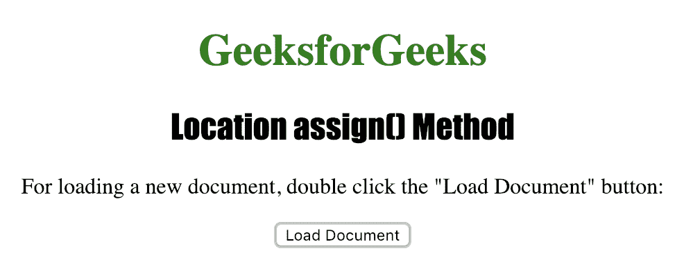
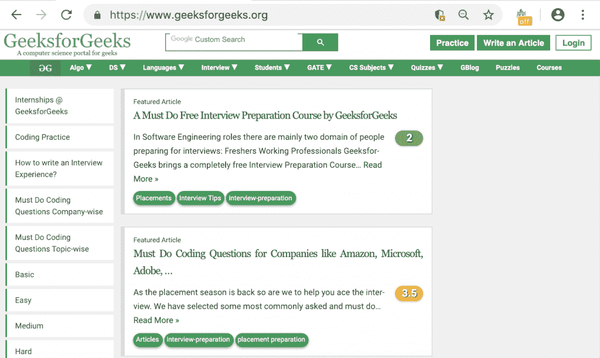

# HTML |位置分配( )方法

> 原文:[https://www.geeksforgeeks.org/html-location-assign-method/](https://www.geeksforgeeks.org/html-location-assign-method/)

**位置分配()**方法用于加载新文档。它也可以用于加载新文档，但这两种方法的区别在于 replace()方法从文档历史记录中删除当前文档的 URL，因此无法使用“后退”按钮导航回原始文档。

**语法:**

```html
location.assign(URL)
```

**使用的参数:**

1.  **网址:**这是一个强制参数，用于指定要导航到的页面的网址。

下面的程序说明了位置分配()方法:

**加载新文档。**

```html
<!DOCTYPE html>
<html>

<head>
    <title>Location assign() Method in HTML</title>
    <style>
        h1 {
            color: green;
        }

        h2 {
            font-family: Impact;
        }

        body {
            text-align: center;
        }
    </style>
</head>

<body>

    <h1>GeeksforGeeks</h1>
    <h2>Location assign() Method</h2>

    <p>For loading a new document, 
      double click the "Load Document" button: </p>

    <button ondblclick="load()">Load Document</button>

    <script>
        function load() {
            location.assign("https://www.geeksforgeeks.org");
        }
    </script>

</body>

</html>

```

**输出:**


**点击**
按钮后

**注意:**上述程序不适用于所有链接，因为在许多情况下不允许交叉成帧，请通过分配链接“https://ide.geeksforgeeks.org/”来尝试。

**支持的网络浏览器**

*   谷歌 Chrome
*   微软公司出品的 web 浏览器
*   火狐浏览器
*   歌剧
*   旅行队