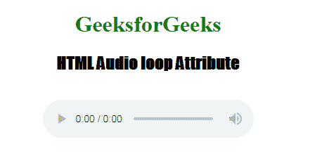
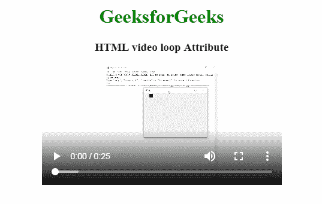

# HTML |循环属性

> 原文:[https://www.geeksforgeeks.org/html-loop-attribute/](https://www.geeksforgeeks.org/html-loop-attribute/)

**HTML 循环属性**用于*完成*后反复重启音视频。它包含布尔值。

**语法:**

```html
<element loop>
```

**适用**

*   <marquee>**示例 1:** 下面的示例说明了循环属性在 **<音频>** 元素中的使用。

    ## 超文本标记语言

    ```html
    <!DOCTYPE html>
    <html>

    <head>
        <title>
            Audio loop Attribute
        </title>
    </head>

    <body style="text-align: center">

        <h1 style="color: green">
        GeeksforGeeks
    </h1>
        <h2 style="font-family: Impact">
        HTML Audio loop Attribute
    </h2>
        <br>

        <audio id="Test_Audio"
               controls loop>
            <source src="beep.mp3"
                    type="audio/mpeg">
        </audio>
    </body>

    </html>
    ```

    **输出:**

    

    **示例 2:** 下面的示例说明了循环属性在 **<视频>** 元素中的使用。

    ## 超文本标记语言

    ```html
    <!DOCTYPE html>
    <html>

    <head>
        <title>
          HTML video loop Attribute
      </title>
    </head>

    <body>
        <center>
            <h1 style="color:green;">
              GeeksforGeeks
          </h1>

            <h3>HTML video loop Attribute</h3>

            <video width="400"
                   height="200"
                   controls loop>

                <source src="Canvas.move_.mp4"
                        type="video/mp4">
                <source src="Canvas.move_.ogg"
                        type="video/ogg">
            </video>
        </center>
    </body>

    </html>
    ```

    **输出:**

    

    **支持的浏览器:****循环属性**支持的浏览器如下:

    *   谷歌 Chrome 4.0/4.0
    *   Internet Explorer 9.0/9.0
    *   Firefox 3.5/11.0
    *   Apple Safari 4.0/4.0
    *   Opera 10.5/10.5</marquee>