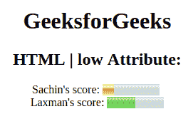

# HTML |低属性

> 原文:[https://www.geeksforgeeks.org/html-low-attribute/](https://www.geeksforgeeks.org/html-low-attribute/)

**HTML | low 属性**用于指定**轨距值被认为低的范围**。低属性的值必须大于**“最小”**，小于**“最大”**和**“高”**属性。
**用法:**此属性仅与<米>标记一起使用。

**语法:**

```html
<meter low="number">
```

**属性值:**包含浮点值，用于指定仪表的低值。

**示例:**本示例说明了米元素中低属性的使用。

## 超文本标记语言

```html
<!DOCTYPE html>
<html>

<head>
    <title>
      HTML | low attribute
    </title>
</head>

<body style="text-align:center;">
    <h1>GeeksforGeeks</h1>
    <h2>HTML | low Attribute:</h2>
    Sachin's score:
    <meter value="2"
           low="3"
           min="0"
           max="10"
           high="6">
      5 out of 10
    </meter>
    <br>
    Laxman's score:
    <meter value="0.5"
           low="0.3"
           max="1.0"
           low=" "
           min="0"
           high="0.6">
      50% from 100%
    </meter>
</body>

</html>
```

**输出:**



**支持的浏览器:***HTML 低属性*支持的浏览器如下:

*   谷歌 Chrome
*   微软公司出品的 web 浏览器
*   火狐浏览器
*   歌剧
*   旅行队