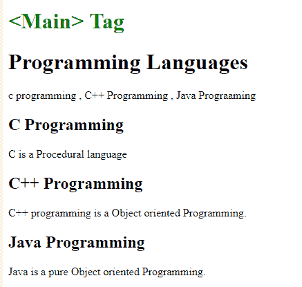

# HTML | main 标签

> 原文:[https://www.geeksforgeeks.org/html-main-tag/](https://www.geeksforgeeks.org/html-main-tag/)

**HTML <主>标签**用于给出文档的主要信息。 **<主>** 元素内的内容对于文档来说应该是唯一的。其中包括侧栏、导航链接、版权信息、网站徽标和搜索表单。

**注意:**文档中不能包含多个 **<主>** 元素。 **<主>** 元素不应该是子元素的一个 **<条>****<一旁>****<页脚>T11】**T26【表头>T13】，或者 **<导航>** 元素。****

**语法:**

```html
<main>
    //contents of main Element 
</main> 

```

**示例:**

```html
<!DOCTYPE html>
<html>

<head>

    <style>
        .class {
            color: green;
        }
    </style>
</head>

<body>
    <h1 class="class"><Main> Tag</h1>
    <main>
        <h1>Programming Languages</h1>
        <p>c programming, C++ 
          Programming, Java Prograaming</p>

        <article>
            <h1>C Programming</h1>
            <p>C is a Procedural language</p>
        </article>

        <article>
            <h1>C++ Programming</h1>
            <p>C++ programming is a 
              Object oriented Programming.</p>
        </article>

        <article>
            <h1>Java Programming</h1>
            <p>Java is a pure Object 
              oriented Programming.</p>
        </article>
    </main>

</body>

</html>
```

**输出:**


**支持的浏览器:**主>标签支持的浏览器如下:

*   谷歌 Chrome
*   微软公司出品的 web 浏览器
*   火狐浏览器
*   苹果 Safari
*   歌剧