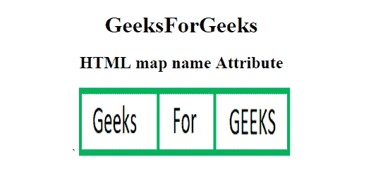

# HTML | map 名称属性

> 原文:[https://www.geeksforgeeks.org/html-map-name-attribute/](https://www.geeksforgeeks.org/html-map-name-attribute/)

**HTML <地图>名称属性**用于指定地图图像的名称，该属性与 **< img >** usemap 属性相关联，并创建了图像和地图之间的关系。

**语法:**

```html
<map name="mapname">
```

**属性值:**

*   **名称:**指定图像地图的名称。

**示例:**

```html
<!DOCTYPE html>
<html>

<head>
    <title>
        HTML name Attribute
    </title>
</head>

<body style="text-align:center;">

    <h1>GeeksForGeeks</h1>
    <h2>HTML map name Attribute</h2> `
    <map id="Geeks" name="Geeks">

        <area shape="rect"
              coords="0, 0, 110, 100"
              alt="Geeks" 
              href=
"https://media.geeksforgeeks.org/wp-content/uploads/a1-21.png">

        <area shape="rect" 
              coords="110, 0, 190, 100" 
              alt="For" 
              href=
"https://media.geeksforgeeks.org/wp-content/uploads/a1-22.png">

        <area shape="rect"
              coords="190, 0, 300, 100"
              alt="GEEKS"
              href=
"https://media.geeksforgeeks.org/wp-content/uploads/a1-24.png">
    </map>

    

</body>

</html>
```

**输出:**
**前:**

**后:**


**支持的浏览器:**支持的浏览器 **HTML <地图>名称属性**如下:

*   谷歌 Chrome
*   微软公司出品的 web 浏览器
*   火狐浏览器
*   苹果 Safari
*   歌剧