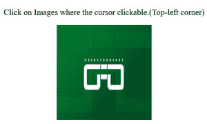

# HTML | map 标签

> 原文:[https://www.geeksforgeeks.org/html-map-tag/](https://www.geeksforgeeks.org/html-map-tag/)

**<地图>** 标签是在用户界面上定义可点击的地图图像。 **<地图>** 需要 **< img >** 标签来帮助图像和地图之间的关系。 **<地图>** 元素包含多个 **<区域>** 元素，用于定义图像地图中的可点击区域。

**语法:**

```html
 <map name=""> </map>
```

**示例:**

## 超文本标记语言

```html
<!DOCTYPE html>
<html>

<head>
    <title>
        HTML | <map> Tag
    </title>
</head>

<body>
    <center>

<p>Click on Images where the cursor
          clickable.(Top-left corner)</p>

        

        <map name="gfg">
            <area shape="rect"
                  coords="0, 0, 50, 50"
                  alt="gfg"
                  href=
"https://media.geeksforgeeks.org/wp-content/uploads/20190821123122/gfgsm.png">
        </map>
    </center>
</body>

</html>
```

**输出:**

**之前:**



**之后:**


**支持的浏览器:**以下列出了 **HTML <地图>标签**支持的浏览器:

*   谷歌 Chrome
*   微软公司出品的 web 浏览器
*   火狐浏览器
*   旅行队
*   歌剧