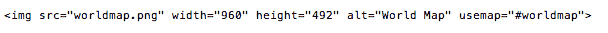
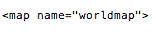
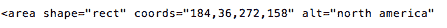

# HTML |映射图像

> 原文:[https://www.geeksforgeeks.org/html-mapping-image/](https://www.geeksforgeeks.org/html-mapping-image/)

**什么是图像映射:**
在图像映射中，用图像内部的某组坐标来指定图像，这些坐标充当到不同目的地的超链接区域。它不同于图像链接，因为在图像链接中，图像可以用于服务单个链接或目的地，而在映射图像中，图像的不同坐标可以服务不同的链接或目的地。

#### 映射图像所需的元素:

创建映射图像需要三个基本的 html 元素。

1.  **地图:**用于创建带有可点击区域的图像地图。
2.  **图像:**用于进行映射的图像源。
3.  **区域:**用于地图内定义可点击区域。

#### 创建映射图像的步骤:

*   **确定图像大小:**
    确定图像的大小非常重要，因为如果图像的大小改变，那么区域坐标也将需要更新。
    
*   **创建叠加图像的地图:**
    
*   **确定要映射区域的坐标:**
    可以做矩形、圆形、多边形三种形状。使用 MS-Paint 可以很容易地找到坐标。
    

**按照下面的代码，将上述所有步骤放在一起。**

```html
<!DOCTYPE html>
<html>

<h3>Mapping an Image

<body>

<p>Click on the different continents of the map to know about them.</p>


<map name="worldmap">
<area shape="rect" coords="184, 36, 272, 158" alt="north america"
                href="https://en.wikipedia.org/wiki/North_America">

<area shape="rect" coords="282, 215, 354, 367" alt="south america" 
                href="https://en.wikipedia.org/wiki/South_America">

<area shape="rect" coords="506, 151, 570, 333" alt="africa"
                href="https://en.wikipedia.org/wiki/Africa">

<area shape="rect" coords="618, 42, 791, 162" alt="asia"
                href="https://en.wikipedia.org/wiki/Asia">

<area shape="rect" coords="509, 44, 593, 110" alt="europe"
               href="https://en.wikipedia.org/wiki/Europe">

<area shape="rect" coords="786, 288, 862, 341" alt="australia" 
              href="https://en.wikipedia.org/wiki/Australia_(continent)">

<area shape="rect" coords="249, 463, 760, 488" alt="antartica"
              href="https://en.wikipedia.org/wiki/Antarctica"> 
</map>

</body>
</html>
```

输出:

影像来源:https://www . pixabay . com/photo/2013/07/12/16/57/world-map-151576 _ 960 _ 720 . png