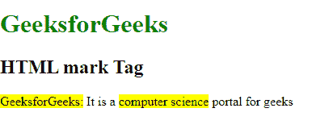
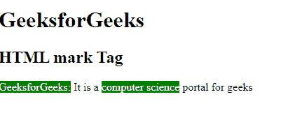

# HTML mark 标签

> 原文:[https://www.geeksforgeeks.org/html-mark-tag/](https://www.geeksforgeeks.org/html-mark-tag/)

HTML 中的<mark>标签用于定义标记的文本。它用于突出段落中的文本部分。<mark>标签在 HTML 5 中是新的。</mark></mark> 

**语法:**

```html
<mark> Contents... </mark>
```

**示例 1:** 本示例使用<标记>标记来突出显示文本。默认情况下，<标记>标记以黄色突出显示文本内容。

## 超文本标记语言

```html
<!DOCTYPE html>
<html>

<body>
    <h1 style="color: green;">GeeksforGeeks</h1>

    <h2>HTML mark Tag</h2>

<p>
        <mark>GeeksforGeeks:</mark> It is a
        <mark>computer science</mark> portal for geeks
    </p>

</body>

</html>
```

**输出:**



**示例 2:** 本示例使用带有 CSS 属性的<标记>标签来更改标记的内容颜色和其他属性。

## 超文本标记语言

```html
<!DOCTYPE html>
<html>

<body>
    <h1>GeeksforGeeks</h1>

    <h2> HTML mark Tag</h2>

    <p>
        <mark>GeeksforGeeks:</mark> It is a
        <mark style="background-color: green; color: white;">
            computer science
        </mark> portal for geeks
    </p>

</body>

</html>
```

**输出:**



**支持的浏览器:**

*   谷歌 Chrome 6.0
*   Internet Explorer 9.0
*   Firefox 4.0
*   歌剧 11.1
*   Safari 5.0