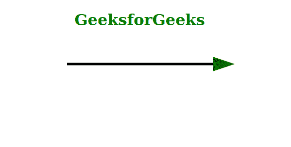
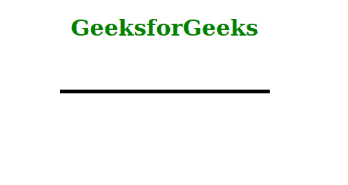

# HTML 标记-结束属性

> 原文:[https://www.geeksforgeeks.org/html-marker-end-attribute/](https://www.geeksforgeeks.org/html-marker-end-attribute/)

*标记结束*属性在给定形状的可标记元素的最后一个顶点绘制一个多标记符或箭头。除了*折线*和*路径*之外，所有可标记元素的第一个顶点都与最后一个顶点相同。在这种情况下，如果*标记开始*和*标记结束*的值都不是“无”，那么这两个标记都将在最后一个顶点上渲染。*标记结束*属性仅在路径数据的最后一个顶点上渲染。*标记-中间*属性只对以下七个元素有效:*路径、折线、多边形、直线、圆、椭圆、*和*矩形。*

**语法:**

```html
marker-end = "marker-reference | none"
```

**属性值:**该属性接受两个值，如上所述，如下所述。

*   **标记-引用:**它在元素的最后一个顶点绘制一个标记。
*   **无:**它不在元素的最后一个顶点添加任何标记。

**示例 1:** 下面是用*标记引用*的值说明*标记结束*属性的使用的代码。

## 超文本标记语言

```html
<!DOCTYPE html>
<html>

<body>
    <div class="Container" style=" 
         color: green; text-align: center;">
        <h1>GeeksforGeeks</h1>
        <svg width="600px" height="100px">
            <defs>
                <marker id="arrow" markerWidth="10" 
                    markerHeight="10" refX="0" 
                    refY="3" orient="auto"
                    markerUnits="strokeWidth">
                    <path d="M0, 0 L0, 6 L9, 3 z" 
                            fill="#006400" />
                </marker>
            </defs>
            <line x1="150" y1="50" x2="450" y2="50" 
                stroke="#000" stroke-width="5" 
                marker-end="url(#arrow)" />
        </svg>
    </div>
</body>

</html>
```

**输出:**



**示例 2:** 下面是说明使用值为“无”的*标记端*属性的代码。

## 超文本标记语言

```html
<!DOCTYPE html>
<html>

<body>
    <div class="Container" style="
        color: green; text-align:center;">

        <h1>GeeksforGeeks</h1>
        <svg width="600px" height="100px">
            <defs>
                <marker id="arrow" markerWidth="10"
                    markerHeight="10" refX="0" 
                    refY="3" orient="auto"
                    markerUnits="strokeWidth">
                    <path d="M0, 0 L0, 6 L9, 3 z" 
                        fill="#006400" />
                </marker>
            </defs>
            <line x1="150" y1="50" x2="450" y2="50" 
                stroke="#000" stroke-width="5" 
                marker-end="none" />
        </svg>
    </div>
</body>

</html>
```

**输出:**



**支持的浏览器:**

*   火狐浏览器
*   铬
*   旅行队
*   边缘
*   歌剧