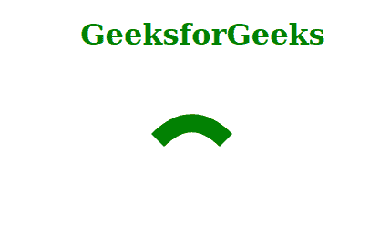
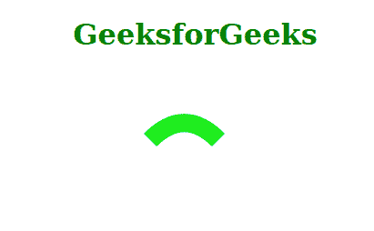

# HTML 标记-中间属性

> 原文:[https://www.geeksforgeeks.org/html-marker-mid-attribute/](https://www.geeksforgeeks.org/html-marker-mid-attribute/)

*标记-中间*属性在给定形状的可标记元素的所有顶点(不包括第一个和最后一个顶点)绘制一个多标记或箭头。*标记-中间*属性仅对以下七个元素有影响，即*路径、折线、多边形、直线、圆、椭圆、*和*矩形*。

**语法:**

```html
marker-mid = "marker-reference | none"
```

**属性值:**该属性接受两个值，如上所述，如下所述。

*   **标记-参考:**此参数在除第一个和最后一个顶点之外的可标记元素顶点处绘制标记。
*   **无:**不在顶点添加任何标记。

**示例 1:** 下面的代码说明了使用*标记-中间*属性，值为*无。*

## 超文本标记语言

```html
<!DOCTYPE html>
<html>

<head>
    <style>
        #Arrow {
            stroke-width: 20;
            stroke: green;
            fill: none;
            marker-mid: none;
        }
    </style>
</head>

<body>
    <div class="Container" style=" 
         color: green; text-align: center;">
        <h1>GeeksforGeeks</h1>
        <svg>
            <marker id="Triangle" viewBox="0 0 10 10" 
                refX="0" refY="5" orient="auto">
                <path d="L 0 0 L 10 5 L 0 10 z">
                </path>
            </marker>

            <g id="Arrow">
                <path d="M 100, 75 C 125, 
                    50 150, 50 175, 75">
                </path>
            </g>
        </svg>
    </div>
</body>

</html>
```

**输出:**



**示例 2:** 下面是说明使用*标记-中间*属性值*标记-引用*的代码。

## 超文本标记语言

```html
<!DOCTYPE html>
<html>

<head>
    <style>
        #Arrow {
            stroke-width: 20;
            stroke: rgb(30, 236, 30);
            fill: none;
            marker-mid: url("#Triangle");
        }
    </style>
</head>

<body>

    <div class="Container" style=" 
        color: green; text-align: center;">
        <h1>GeeksforGeeks</h1>
        <svg>
            <marker id="Triangle" viewBox="0 0 10 10"
                refX="0" refY="5" orient="auto">
                <path d="M 0 0 L 10 5 L 0 10 z"></path>
            </marker>
            <g id="Arrow">
                <path d="M 100, 75 C 125, 
                    50 150, 50 175, 75">
                </path>
            </g>
        </svg>
    </div>
</body>

</html>
```

**输出:**



**支持的浏览器:**

*   铬
*   火狐浏览器
*   歌剧
*   旅行队
*   边缘
*   微软公司出品的 web 浏览器