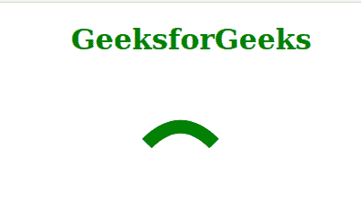
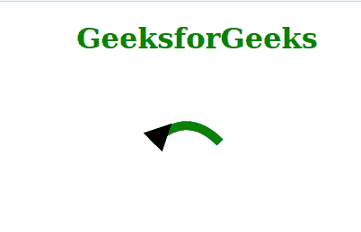

# HTML 标记-开始属性

> 原文:[https://www.geeksforgeeks.org/html-marker-start-attribute/](https://www.geeksforgeeks.org/html-marker-start-attribute/)

*标记-开始*属性在给定形状的可标记元素的开始顶点绘制一个多标记或箭头。除了*折线*和*路径，*第一个顶点与所有可标记元素的最后一个顶点相同。在这种情况下，如果*标记开始*和*标记结束*的值都不是“无”，那么这两个标记都将在最后一个顶点上渲染。*标记-开始*属性仅在路径数据的开始顶点上渲染。*标记-中间*属性仅对以下七个元素有效:*路径、折线、多边形、直线、圆、椭圆*和*矩形*。

**语法:**

```html
 marker-start = "marker-reference | none"

```

**属性值:**该属性接受两个值，如上所述，如下所述。

*   **标记-引用:**它在元素的开始顶点绘制一个标记。
*   **无:**它不在元素的开始顶点添加任何标记。

**示例 1:** 下面的代码说明了使用值为“*无的*标记-开始*属性。*”

## 超文本标记语言

```html
<!DOCTYPE html>
<html>

<head>
    <style>
        .geeks {
            stroke-width: 15;
            stroke: green;
            fill: none;
            marker-start: none;
        }
    </style>
</head>

<body>
    <div class="Container" style="
        color: green; text-align:center;">

        <h1>GeeksforGeeks</h1>
        <svg>
            <marker id="Triangle" 
                viewBox="0 0 10 10" refX="0" 
                refY="5" orient="auto">
                <path d="M 0 0 L 10 5 L 0 10 z">
                </path>
            </marker>
            <g class="geeks">
                <path d="M 100, 75 C 125, 
                    50 150, 50 175, 75">
                </path>
            </g>
        </svg>
    </div>
</body>

</html>
```

**输出:**



**示例 2:** 下面是用*标记-引用*的值说明*标记-开始*属性的使用的代码。

## 超文本标记语言

```html
<!DOCTYPE html>
<html>

<head>
    <style>
        .geeks {
            stroke-width: 10;
            stroke: green;
            fill: none;
        }
    </style>
</head>

<body>

    <div class="Container" style="
         color: green; text-align:center;">
        <h1>GeeksforGeeks</h1>
        <svg>
            <marker id="Triangle" 
                viewBox="0 0 10 10" refX="0" 
                refY="5" orient="auto">
                <path d="M 0 0 L 10 5 L 0 10 z">
                </path>
            </marker>
            <g class="geeks" style=
                "marker-start: url(#Triangle);">

                <path d="M 100, 75 C 
                    125, 50 150, 50 175, 75">
                </path>
            </g>
        </svg>
    </div>
</body>

</html>
```

**输出:**



**支持的浏览器:**

*   铬
*   火狐浏览器
*   边缘
*   歌剧
*   旅行队