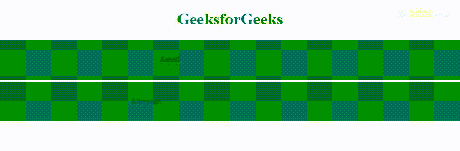

# HTML |跑马灯行为属性

> 原文:[https://www . geesforgeks . org/html-marquee-behavior-attribute/](https://www.geeksforgeeks.org/html-marquee-behavior-attribute/)

HTML 中的**字幕行为属性**用于设置滚动的行为。默认值为滚动。

**语法:**

```html
<marquee behavior=slide >
```

**属性值:**

*   **滚动:**
*   **幻灯片:**
*   **交替**

**示例:**

```html
<!DOCTYPE html>
<html>

<head>
    <title>Marquee Tag</title>
    <style>
        .main {
            text-align: center;
        }

        .marq {
            padding-top: 30px;
            padding-bottom: 30px;
        }
    </style>
</head>

<body>
    <h1 style="color:green; text-align:center;">GeeksforGeeks</h1>
    <div class="main">
        <marquee class="marq"
                 bgcolor="Green"
                 direction="left"
                 behavior=scroll 
                 loop="">
            Scroll
        </marquee>
        <marquee class="marq"
                 bgcolor="Green"
                 behavior=alternate
                 direction="left"
                 loop="">
            Alternate
        </marquee>
    </div>
</body>

</html>
```

**输出:**


**支持的浏览器:****HTML 字幕行为属性**支持的浏览器如下:

*   谷歌 Chrome
*   微软公司出品的 web 浏览器
*   火狐浏览器
*   苹果 Safari
*   歌剧