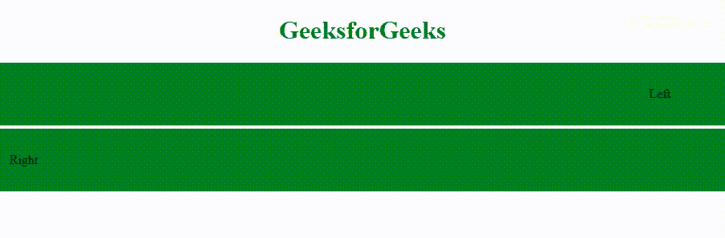

# HTML |跑马灯方向属性

> 原文:[https://www . geesforgeks . org/html-marquee-direction-attribute/](https://www.geeksforgeeks.org/html-marquee-direction-attribute/)

HTML 中的 [**选框**](https://www.geeksforgeeks.org/html-marquee-tag/) **方向属性**用于设置滚动方向。默认的滚动方向是向左。可能的值有上、下、左、右。
**语法:**

```html
<marquee direction= up | down | left | right>
```

**属性值:**

*   向上
*   向下
*   左边的
*   正确

**例:**

## 超文本标记语言

```html
<!DOCTYPE html>
<html>

<head>
    <title>Marquee Tag</title>
    <style>
        .main {
            text-align: center;
        }

        .marq {
            padding-top: 30px;
            padding-bottom: 30px;
        }
    </style>
</head>

<body>
    <h1 style="color:green; text-align:center;">
      GeeksforGeeks
  </h1>
    <div class="main">
        <marquee class="marq"
                 bgcolor="Green"
                 direction="left"
                 loop="">
            Left
        </marquee>
        <marquee class="marq"
                 bgcolor="Green"
                 direction="right"
                 loop="">
            Right
        </marquee>
    </div>
</body>

</html>
```

**输出:**



**支持的浏览器:****HTML 字幕方向属性**支持的浏览器如下:

*   谷歌 Chrome
*   微软公司出品的 web 浏览器
*   火狐浏览器
*   苹果 Safari
*   歌剧