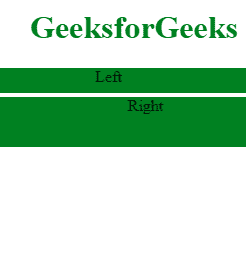

# HTML |跑马灯高度属性

> 原文:[https://www . geesforgeks . org/html-marquee-height-attribute/](https://www.geeksforgeeks.org/html-marquee-height-attribute/)

HTML 中的 [**【字幕】**](https://www.geeksforgeeks.org/html-marquee-tag/) **高度属性**用于设置字幕的高度，以像素或百分比值为单位。
**语法:**

```html
<marquee height="px/%" >
```

**属性值:**

*   **px:** 定义字幕的高度值。
*   **%:** 定义字幕的高度值。

**例:**

## 超文本标记语言

```html
<!DOCTYPE html>
<html>

<head>
    <title>Marquee Tag</title>
    <style>
        .main {
            text-align: center;
        }
    </style>
</head>

<body>
    <h1 style="color:green; text-align:center;">
      GeeksforGeeks
  </h1>
    <div class="main">
        <marquee height=25px
                 bgcolor="Green"
                 direction="left"
                 loop="">
            Left
        </marquee>
        <marquee height=50px
                 bgcolor="Green"
                 direction="right"
                 loop="">
            Right
        </marquee>
    </div>
</body>

</html>
```

**输出:**



**支持的浏览器:****HTML 字幕高度属性**支持的浏览器如下:

*   谷歌 Chrome
*   微软公司出品的 web 浏览器
*   火狐浏览器
*   苹果 Safari
*   歌剧