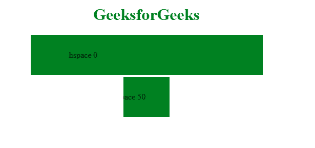

# HTML | Marquee hspace 属性

> 原文:[https://www . geesforgeks . org/html-marquee-hspace-attribute/](https://www.geeksforgeeks.org/html-marquee-hspace-attribute/)

HTML 中的**字幕空间属性**用于设置水平边距。给定值用于设置字幕元素和其他内容之间的间距。
**语法:**

```html
<marquee hspace="px/%" >
```

**属性值:**

*   **px:** 指定选框周围的水平间距。
*   **%:** 指定选框周围的水平间距。

**例:**

## 超文本标记语言

```html
<!DOCTYPE html>
<html>

<head>
    <title>Marquee Tag</title>
    <style>
        .main {
            text-align: center;
        }

        .marq {
            padding-top: 30px;
            padding-bottom: 30px;
        }
    </style>
</head>

<body>
    <h1 style="color:green; text-align:center;">
      GeeksforGeeks
  </h1>
    <div class="main">
        <marquee class="marq"
                 bgcolor="Green"
                 direction="left"
                 loop=""
                 hspace="25%">
            hspace 0
        </marquee>
        Other content
        <marquee class="marq"
                 bgcolor="Green"
                 direction="left"
                 loop=""
                 hspace="45%">
            hspace 50
        </marquee>
        Other content
    </div>
</body>

</html>
```

**输出:**



**支持的浏览器:****HTML Marquee hspace 属性**支持的浏览器如下:

*   谷歌 Chrome
*   微软公司出品的 web 浏览器
*   火狐浏览器
*   苹果 Safari
*   歌剧