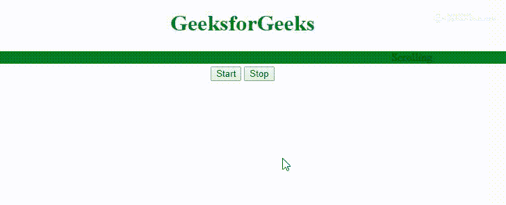

# HTML |字幕停止方法

> 原文:[https://www.geeksforgeeks.org/html-marquee-stop-method/](https://www.geeksforgeeks.org/html-marquee-stop-method/)

HTML 中的 **[选框](https://www.geeksforgeeks.org/html-marquee-tag/)停止方法**用于停止滚动。要开始滚动，请使用**开始()方法**。

**语法:**

```html
Object.stop()
```

**返回值:**这个方法没有返回值。

**示例:**

```html
<!DOCTYPE html>
<html>

<head>
    <title>Marquee Tag</title>
    <style>
        .main {
            text-align: center;
        }
    </style>
</head>

<body>
    <h1 style="color:green; text-align:center;">
      GeeksforGeeks
  </h1>
    <div class="main">
        <marquee id="marID" 
                 bgcolor="Green"
                 direction="left"
                 loop="">
            Scrolling
        </marquee>
        <br />
        <input type="button"
               onclick="marID.start()" 
               value="start">

        <input type="button" 
               onclick="marID.stop()"
               value="Stop">
    </div>
</body>

</html>
```

**输出:**


**支持的浏览器:****HTML 字幕停止方式**支持的浏览器如下:

*   谷歌 Chrome
*   微软公司出品的 web 浏览器
*   火狐浏览器
*   苹果 Safari
*   歌剧