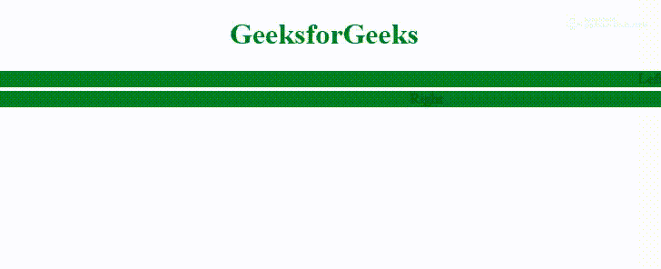

# HTML | Marquee truespeed 属性

> 原文:[https://www . geesforgeks . org/html-marquee-true speed-attribute/](https://www.geeksforgeeks.org/html-marquee-truespeed-attribute/)

如果滚动延迟值小于 60，并且 truespeed 模式打开，则滚动延迟值不会影响滚动。
如果滚动延迟值大于 60，并且真实速度模式开启，则真实速度不会影响滚动。所以，基本上它是用来设置 scrollDelay 属性是否应该取一个确切的值。
**语法:**

```html
<marquee truespeed="truespeed" >
```

**属性值:**
真实速度没有值。指定任意值与不指定值具有相同的效果。

```html
truespeed 
truespeed="true"
truespeed="false"
truespeed="on"
truespeed="truespeed" 
```

**例:**

## 超文本标记语言

```html
<!DOCTYPE html>
<html>

<head>
    <title>Marquee Tag</title>
    <style>
        .main {
            text-align: center;
        }
    </style>
</head>

<body>
    <h1 style="color:green; text-align:center;">
      GeeksforGeeks
  </h1>
    <div class="main">
        <marquee scrollamount="3"
                 scrolldelay="6"
                 bgcolor="Green"
                 direction="left"
                 loop="">
            Left
        </marquee>
        <marquee scrollamount="3"
                 scrolldelay="6"
                 truespeed="truespeed"
                 bgcolor="Green"
                 direction="right"
                 loop="">
            Right
        </marquee>
    </div>
</body>

</html>
```

**输出:**



**支持的浏览器:**以下列出 **HTML Marquees truespeed 属性**支持的浏览器:

*   谷歌 Chrome
*   微软公司出品的 web 浏览器
*   火狐浏览器
*   苹果 Safari
*   歌剧