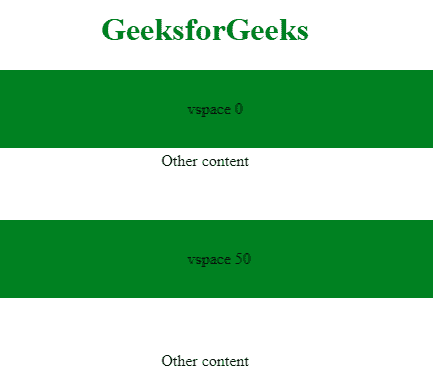

# HTML | Marquee vs space 属性

> 原文:[https://www . geesforgeks . org/html-marquee-vspace-attribute/](https://www.geeksforgeeks.org/html-marquee-vspace-attribute/)

HTML 中的**选取框 vspace 属性**用于设置垂直边距。给定值用于设置字幕元素和其他内容之间的间距。
**语法:**

```html
<marquee vspace="px">
```

**属性值:**

*   **px:** 指定字幕周围的垂直空间。

**例:**

## 超文本标记语言

```html
<!DOCTYPE html>
<html>

<head>
    <title>Marquee Tag</title>
    <style>
        .main {
            text-align: center;
        }

        .marq {
            padding-top: 30px;
            padding-bottom: 30px;
        }
    </style>
</head>

<body>
    <h1 style="color:green; text-align:center;">GeeksforGeeks</h1>
    <div class="main">
        <marquee class="marq"
                 bgcolor="Green"
                 direction="left"
                 loop=""
                 vspace=0>
            vspace 0
        </marquee>
        Other content
        <marquee class="marq"
                 bgcolor="Green"
                 direction="left"
                 loop=""
                 vspace=50>
            vspace 50
        </marquee>
        Other content
    </div>
</body>

</html>
```

**输出:**



**支持的浏览器:****HTML Marquee vspace 属性**支持的浏览器如下:

*   谷歌 Chrome
*   微软公司出品的 web 浏览器
*   火狐浏览器
*   苹果 Safari
*   歌剧