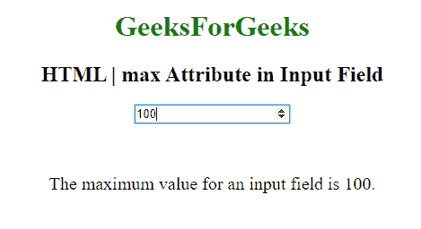

# HTML | max 属性

> 原文:[https://www.geeksforgeeks.org/html-max-attribute/](https://www.geeksforgeeks.org/html-max-attribute/)

在 **HTML max 属性**中，它指定了一个元素的最大值。当进度元素使用 max 属性时，它指定任务在总任务中需要多少工时。

**适用于:**
最大属性用于以下元素:

*   [输入最大值](https://www.geeksforgeeks.org/html-inputmax-attribute/)
*   [仪表最大值](https://www.geeksforgeeks.org/html-meter-max-attribute/)
*   [最大进度](https://www.geeksforgeeks.org/html-progress-max-attribute/)

**示例:**

```html
<!DOCTYPE html>
<html>

<body style="text-align:center;">

    <h1 style="color:green;"> 
            GeeksForGeeks 
        </h1>

    <h2> 
    HTML | max Attribute in Input Field 
</h2>
    <form id="myGeeks">
        <input type="number"
               id="myNumber"
               step="5"
               name="geeks"
               placeholder="multiples of 5"
               max="100">
    </form>
    <br>
    <br>
    <p style="font-size:20px;">
        The maximum value for an input field is 100.
    </p>
</body>

</html>
```

**输出:**


**支持的浏览器:**以下是 **HTML | max 属性**支持的浏览器:

*   谷歌 Chrome
*   歌剧
*   旅行队
*   火狐浏览器
*   仪表属性不支持 Internet Explorer