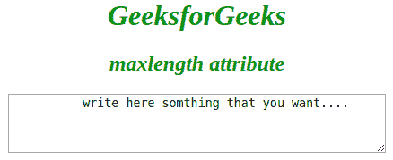

# HTML 最大长度属性

> 原文:[https://www.geeksforgeeks.org/html-maxlength-attribute/](https://www.geeksforgeeks.org/html-maxlength-attribute/)

它指定元素中允许的最大字符数。
可用于以下元素:

1.  [<输入>](https://www.geeksforgeeks.org/html-input-maxlength-attribute/?ref=rp)
2.  textarea>

**属性值:**它包含一个允许<输入>元素中最大字符数的单个数值。它的默认值是 524288。

**示例:**

*   **例为** [**<输入>**](https://www.geeksforgeeks.org/html-input-maxlength-attribute/?ref=rp) **元素:**

## 超文本标记语言

```html
<!DOCTYPE html>
<html>

<body>
    <center>
        <h1 style="color:green;font-style:italic;">
          GeeksForGeeks
        </h1>
        <h2 style="color:green;font-style:italic;">
          maxlength attribute
        </h2>
        <form action="">
            Username:
            <input type="text" name="usrname" maxlength="12">
            <br>
            <br>
            Password:
            <input type="text" name="password" maxlength="10">
            <br>
            <br>
            <input type="submit" value="Submit">
        </form>
    </center>
</body>

</html>
```

**输出:**


*   **例如**[**<text area>**](https://www.geeksforgeeks.org/html-textareamaxlength-attribute/?ref=rp)**元素:**

## 超文本标记语言

```html
<!DOCTYPE html>
<html>

<body>
    <center>
        <h1 style="color:green;font-style:italic;">
          GeeksforGeeks
        </h1>
        <h2 style="color:green;font-style:italic;">
          maxlength attribute
        </h2>
        <textarea rows="4" cols="50" maxlength="6">
          write here something that you want....
        </textarea>
  </center>
</body>

</html>
```

**输出:**



**支持的浏览器:***maxlength*属性支持的浏览器如下:

*   谷歌 Chrome
*   微软公司出品的 web 浏览器
*   火狐浏览器
*   歌剧
*   旅行队