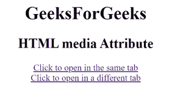

# HTML |媒体属性

> 原文:[https://www.geeksforgeeks.org/html-media-attribute/](https://www.geeksforgeeks.org/html-media-attribute/)

**超文本标记语言媒体属性**用于指定耦合文档优化的媒体或设备。此属性指定目标网址是为特殊设备设计的，如 iPhone、语音或打印媒体。

这个属性可以接受几个值。
**适用:**

*   [<一>](https://www.geeksforgeeks.org/html-a-media-attribute/?ref=rp)
*   [<地区>](https://www.geeksforgeeks.org/html-area-media-attribute/)；
*   [<链接>](https://www.geeksforgeeks.org/html-link-media-attribute/)
*   [<来源>](https://www.geeksforgeeks.org/html-source-media-attribute/)
*   [<风格>](https://www.geeksforgeeks.org/html-style-media-attribute/)

**示例:** HTML <一个>媒体属性

## 超文本标记语言

```html
<html>

<body>
    <h1>GeeksForGeeks</h1>
    <h2>
    HTML media Attribute
</h2>
    <a href="https://ide.geeksforgeeks.org/"
       media="print and (resolution:300dpi)">
        Click to open in the same tab
    </a>
    <br>
    <a href="https://ide.geeksforgeeks.org/"
       target="_blank"
       media="print and (resolution:300dpi)">
        Click to open in a different tab
    </a>
</body>

</html>
```

**输出:**



**示例:** HTML <来源>媒体属性

## 超文本标记语言

```html
<!DOCTYPE html>
<html>

<head>
    <meta name="viewport"
        content="width=device-width, initial-scale=1.0">
</head>

<body>

    <picture>
        <source media="(min-width: 600px)"
                srcset=
"https://media.geeksforgeeks.org/wp-content/uploads/20190328185307/gfg28.png">
        <source media="(min-width: 400px)"
                srcset=
"https://media.geeksforgeeks.org/wp-content/uploads/20190809013546/gfg_350X350.png">
        
    </picture>

</body>

</html>
```

**输出:**更改浏览器大小。


**支持的浏览器:****HTML 媒体属性**支持的浏览器如下:

*   谷歌 Chrome
*   微软公司出品的 web 浏览器
*   火狐浏览器
*   苹果 Safari
*   歌剧