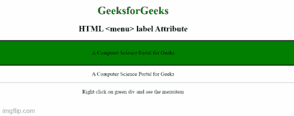

# HTML menu 标签属性

> 原文:[https://www.geeksforgeeks.org/html-menu-label-attribute/](https://www.geeksforgeeks.org/html-menu-label-attribute/)

**HTML<菜单>标签属性**用于指定一个文本值，该文本值表示**菜单**元素**的可见标签名称**虽然**、**这个属性也用于指定菜单内部菜单项的名称。

**语法:**

```html
<menu label="text"> 
```

**属性值**

*   **文本:**它包含定义菜单标签名称的单个值

**示例:**下面的代码说明了标签属性与<菜单>标签的使用。；

## 超文本标记语言

```html
<!DOCTYPE html>
<html>

<body>
    <center>
        <h1 style="color: green;">
            GeeksforGeeks
        </h1>

        <h2>HTML <menu> label Attribute</h2>

        <div style="background:green;
            border:2px solid black;
            padding: 10px;" contextmenu="geeks">

            <p>A Computer Science Portal for Geeks</p>

            <menu type="context" id="geeks">
                <menu label="Share on...">
                    <menuitem label="Twitter" onclick=
                    "window.open('//twitter.com/intent/tweet?text='
                    + window.location.href);">
                    </menuitem>
                    <menuitem label="Pinterest" onclick="window.open(
                        'http://pinterest.com/pin/create/button/?url=' + 
                        window.location.href);">
                    </menuitem>
                </menu>

                <menuitem label="Email This Page" 
                    onclick="window.location='mailto:?body='
                    + window.location.href;">
                </menuitem>
            </menu>
        </div>
        <p>A Computer Science Portal for Geeks</p>
        <hr>
        <p>Right click on green div and see the menuitem
    </center>
</body>

</html>
```

**输出:**



**支持的浏览器:**

*   Firefox 8.0