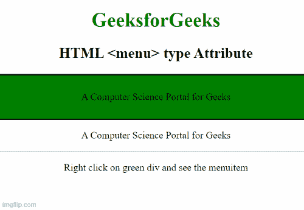

# HTML menu 类型属性

> 原文:[https://www.geeksforgeeks.org/html-menu-type-attribute/](https://www.geeksforgeeks.org/html-menu-type-attribute/)

[**<菜单>**](https://www.geeksforgeeks.org/html-menu-label-attribute/) 元素中的**类型属性用于定义菜单栏的类型。它还与定义菜单项命令类型的 [<菜单项>](https://www.geeksforgeeks.org/html-menuitem-tag/) 标签一起使用。**

**语法:**

```html
<menu type="list|context|toolbar">
```

**属性值:**

*   **列表:**有默认值。它定义了与用户交互时执行某些操作的菜单列表。
*   **上下文:**它定义了一个上下文菜单，将在与用户交互之前执行一个动作。
*   **工具栏:**它定义了一个允许命令的工具栏菜单，允许用户立即与命令交互。

**示例:**下面的 HTML 代码演示了 HTML [<菜单>](https://www.geeksforgeeks.org/html-menu-label-attribute/) 类型属性。

## 超文本标记语言

```html
<!DOCTYPE html>
<html>

<body>
    <center>
        <h1 style="color:green;">
            GeeksforGeeks
        </h1>

        <h2>HTML <menu> type attribute</h2>

        <div style="background:green;
                    border:2px solid black;
                    padding: 10px;" 
             contextmenu="geeks">
            <p>A Computer Science Portal for Geeks</p>

            <menu type="context" id="menuID">

                <menu label="Share on...">
                    <menuitem label="Twitter" 
                              onclick=
"window.open('//twitter.com/intent/tweet?text='+ window.location.href);">
                    </menuitem>
                    <menuitem label="Pinterest" onclick=
                    "window.open(
        'http://pinterest.com/pin/create/button/?url=' + 
                        window.location.href);">
                    </menuitem>
                </menu>

                <menuitem label="Email This Page" 
                    onclick="window.location='mailto:?body='
                    + window.location.href;">
                </menuitem>
            </menu>
        </div>

        <p>A Computer Science Portal for Geeks</p>

        <hr>
        <p>Right click on green div and see the menuitem
    </center>
</body>

</html>
```

**输出:**



**支持的浏览器**

*   Firefox 8.0