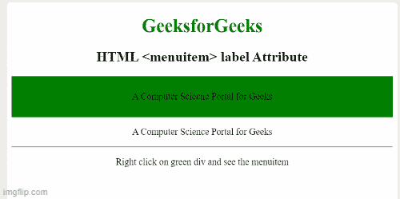

# HTML menuitem 标签属性

> 原文:[https://www . geesforgeks . org/html-menuitem-label-attribute/](https://www.geeksforgeeks.org/html-menuitem-label-attribute/)

**HTML <菜单项>标签**属性用于指定代表命令或菜单项名称的文本值。

**语法:**

```html
<menuitem label="text">
```

**属性值:**它包含一个定义更短描述的值。

**示例:**下面的代码说明了标签属性与 [<菜单项>](https://www.geeksforgeeks.org/html-menuitem-tag/) 标签的使用。

## 超文本标记语言

```html
<!DOCTYPE html>
<html>

<body>
    <center>
        <h1 style="color: green;">
            GeeksforGeeks
        </h1>

        <h2>HTML menuitem label Attribute</h2>

        <div style="background:green;
            border:2px solid black;
            padding: 10px;" contextmenu="geeks">

            <p>A Computer Science Portal for Geeks</p>

            <menu type="context" id="geeks">
                <menu label="Share on...">
                    <menuitem label="Twitter" onclick=
        "window.open('//twitter.com/intent/tweet?text='
                    + window.location.href);">
                    </menuitem>
                    <menuitem label="Pinterest" onclick=
                    "window.open(
        'http://pinterest.com/pin/create/button/?url=' + 
                        window.location.href);">
                    </menuitem>
                </menu>

                <menuitem label="Email This Page" 
                    onclick="window.location='mailto:?body='
                    + window.location.href;">
                </menuitem>
            </menu>
        </div>

        <p>A Computer Science Portal for Geeks</p>

        <hr>
        <p>Right click on green div and see the menuitem
    </center>
</body>

</html>
```

**输出:**



**支持的浏览器:**

*   Firefox 8.0