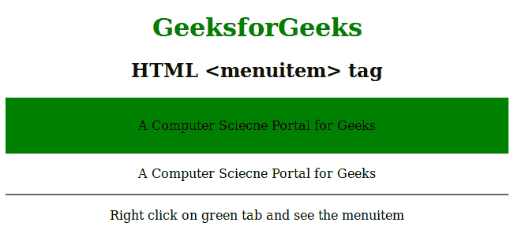
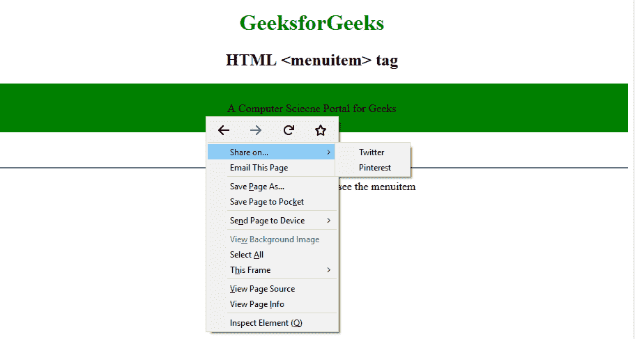

# HTML | menuitem 标签

> 哎哎哎:# t0]https://www . geeksforgeeks . org/html-menu item-tag/

**HTML <菜单项>标签**用于定义用户可以从弹出项目中使用的命令或菜单。HTML5 中不支持此标签。这个标签支持 HTML 中的全局属性和 HTML 中的事件属性。

**语法:**

```html
<menuitem label="" icon="" type> </menuitem>
```

**属性:**

*   **选中:**该属性定义当页面加载时菜单项被选中，在单选和复选框类型下工作。
*   **默认:**该属性将菜单项标记为默认命令。
*   **禁用:**该属性禁用菜单或命令。
*   **图标:**该属性使用 url 定义菜单图标。
*   **标签:**该属性是定义命令或菜单名称的必选项。
*   **radiogroup:** 该属性定义命令组。
*   **类型:**该属性定义命令或菜单的类型，是单选、复选框还是其他。

下面的例子说明了 **HTML <菜单项>标签:**

**示例:**

## 超文本标记语言

```html
<!DOCTYPE html>
<html>

<head>
    <title>HTML <menuitem> Tag</title>
    <style>
        h1 {
            color: green;
        }
    </style>
</head>

<body>
    <center>
        <h1>GeeksforGeeks</h1>
        <h2>HTML <menuitem> tag</h2>
        <div style="background:green;border:2px solid
                    #black;padding: 10px;" contextmenu="geeks">

<p>A Computer Science Portal for Geeks</p>

            <menu type="context" id="geeks">
                <menu label="Share on...">
                    <menuitem label="Twitter"
                              onclick=
"window.open('//twitter.com/intent/tweet?text=' + window.location.href);">
                    </menuitem>
                    <menuitem label="Pinterest"
                              onclick=
"window.open('http://pinterest.com/pin/create/button/?url=' + window.location.href);">
                    </menuitem>
                </menu>
                <menuitem label="Email This Page"
                          onclick=
"window.location='mailto:?body='+window.location.href;">
                </menuitem>
            </menu>

        </div>

<p>A Computer Science Portal for Geeks</p>

        <hr>

<p>Right click on green div and see the menuitem
    </center>
</body>

</html>
```

**输出:**
**前:**



**之后:**



**支持的浏览器:**下面列出了 **<菜单项>标签**支持的浏览器:

*   Mozilla Firefox