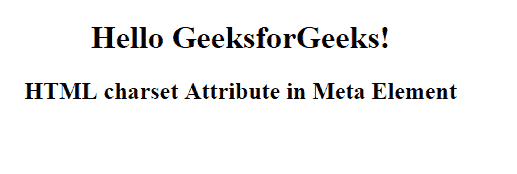

# HTML | 字符集属性

> 原文:[https://www.geeksforgeeks.org/html-meta-charset-attribute/](https://www.geeksforgeeks.org/html-meta-charset-attribute/)

**HTML 字符集属性**用于指定*HTML 文档的字符编码*。使用任何元素的 lang 属性都可以重写 charset 属性。

**语法:**

```html
<meta charset="character_set">
```

**属性值:**它包含指定 HTML 文档字符编码的值，即**字符集**。
**价值观:**

*   **UTF-8:** 指定 Unicode 的字符编码。
*   **ISO-8859-1:** 它规定了拉丁字母的字符编码。

**示例:**本示例说明了元元素中字符集属性的使用。

```html
<!DOCTYPE html>
<html>

<head>
    <title>
      HTML charset Attribute
  </title>
    <meta name="keywords" 
          charset="UTF-8"
          content="Meta Tags, Metadata" />
</head>

<body style="text-align:center">
    <H1>Hello GeeksforGeeks!</H1>
    <h2>
      HTML charset Attribute in Meta Element
  </h2>
</body>

</html>
```

**输出:**


**支持的浏览器:**以下列出了 **HTML < meta >字符集属性**支持的浏览器:

*   谷歌 Chrome
*   微软公司出品的 web 浏览器
*   火狐浏览器
*   歌剧
*   旅行队