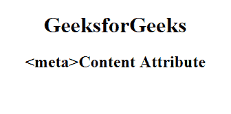

# HTML | 内容属性

> 原文:[https://www.geeksforgeeks.org/html-meta-content-attribute/](https://www.geeksforgeeks.org/html-meta-content-attribute/)

HTML 中的 **<元>内容属性**用于给定与 http-equiv 或名称属性相关的值。内容属性可以与<元>元素相关联。

**语法:**

```html
<meta content="text">
```

**属性值:**包含单值**文本**，用于指定元信息的内容。

**示例:**

```html
<!DOCTYPE html> 
<html> 

<head> 
    <title> 
    content attribute in HTMLs 
</title> 
    <meta name="keywords"
        content="content attribute 
                in Meta Tag, Metadata" /> 
</head> 

<body style="text-align:center;"> 
    <h1> GeeksforGeeks</h1> 
    <h2><meta>Content Attribute</h2> 
</body> 

</html> 
```

**输出:**


**支持的浏览器:**以下是 **HTML < meta >内容属性**支持的浏览器:

*   谷歌 Chrome
*   微软公司出品的 web 浏览器
*   火狐浏览器
*   歌剧
*   旅行队