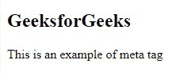

# HTML 标签

> 原文:[https://www.geeksforgeeks.org/html-meta-tag/](https://www.geeksforgeeks.org/html-meta-tag/)

**示例:**这个简单的示例说明了在提供信息的头标签中使用元标签。

## 超文本标记语言

```html
<!DOCTYPE html>
<html>

<head>
    <meta charset="utf-8">
    <meta name="viewport" 
          content="width=device-width,
                   initial-scale=1,
                   maximum-scale=1">
    <meta name="description" 
          content="A Computer Science portal for geeks. 
                   It contains well written, well thought 
                   and well explained computer science and 
                   programming articles, quizzes and practice/competitive
                   programming/company interview Questions.">
    <meta http-equiv="Content-Type" 
          content="text/html; charset=utf-8" />
</head>

<body>
    <h2>GeeksforGeeks</h2>
    <p>This is an example of meta tag</p>

</body>

</html>
```

**输出:**



元数据意味着关于数据的信息。HTML 中的标签提供了关于 HTML 文档的信息，或者简单的说，它提供了关于文档的重要信息。在制作网页或网站时添加元标签是一个很好的做法，因为像谷歌这样的搜索引擎会搜索这个元标签，以便理解网站提供的信息。如果用户搜索特定的网站，那么搜索引擎结果页面将显示搜索结果中的片段，这些片段将提供与该网站相关的信息，这也是有帮助的。这些标签基本上用于添加名称/值对来描述 HTML 文档的属性，例如到期日期、作者姓名、关键词列表、文档作者等。，它用于指定字符集、页面描述、关键字、文档作者和视口设置。这个标记是一个空元素，因为它只有一个开始标记，没有结束标记，但是它在属性中携带信息。一个 web 文档可以根据信息包含一个或多个元标签，但一般来说，它不会影响文档的物理外观。

**语法**

```html
<meta attribute-name="value">
```

**属性:**这个标签接受下面提到和描述的四个属性。

*   [**名称**](https://www.geeksforgeeks.org/html-meta-name-attribute/) **:** 此属性用于定义属性的名称。
*   [**http-equiv**](https://www.geeksforgeeks.org/html-meta-http-equiv-attribute/)**:**该属性用于获取 HTTP 响应消息头。
*   [**内容**](https://www.geeksforgeeks.org/html-meta-content-attribute/) **:** 该属性用于指定属性值。
*   [**字符集**](https://www.geeksforgeeks.org/html-meta-charset-attribute/#:~:text=HTML%20%7C%20charset%20Attribute,-Last%20Updated%20%3A%2029&text=The%20HTML%20charset%20Attribute%20is,lang%20attribute%20of%20any%20element.) :该属性用于指定 HTML 文件的字符编码。

**注意:**元标签也接受 HTML 中的[全局属性](https://www.geeksforgeeks.org/html-global-attributes/)

**要点:**

*   标签内容在您的浏览器上不可见，但可以被机器解析。
*   它们只是用来提供关于 HTML 文档的附加信息。
*   为了[搜索引擎优化的目的，标签被添加到我们的 HTML 文档中。](https://www.geeksforgeeks.org/what-is-seo-page-title-tag/)
*   它们被添加到标签中&被浏览器、搜索引擎和其他网络服务使用。
*   通过标签，设计师可以控制视口。

我们将通过例子理解所有这些概念。

**突出显示重要关键词:**元标签包含存在于网页上的重要关键词，并被网络浏览器用来根据搜索对页面进行排名。搜索引擎优化是优化内容搜索引擎优化排名的另一个术语。

**示例:**

## 超文本标记语言

```html
<!DOCTYPE html>
<html>

<head>
    <!-- meta tag starts -->
    <meta name="keywords" 
          content="Meta Tags, Metadata" />
    <!-- meta tag ends -->
</head>

<body>
    <p>Hello GeeksforGeeks!</p>

</body>

</html>
```