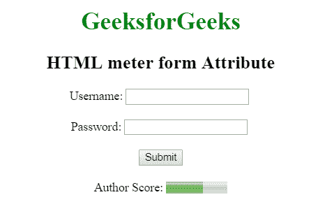

# HTML | meter 表单属性

> 原文:[https://www.geeksforgeeks.org/html-meter-form-attribute/](https://www.geeksforgeeks.org/html-meter-form-attribute/)

**HTML <米>表单属性**用于指定<米>元素可以包含一个或多个表单。
**语法:**

```html
<meter form="form_id">
```

**属性值:**包含单个值 **form_id** ，指定<米>元素所属的一个或多个表单。该属性的值应该是<表单>元素的 id。
**例:**

## 超文本标记语言

```html
<!DOCTYPE html>
<html>
    <head>
        <title>
            HTML meter form Attribute
        </title>
    </head>

    <body style = "text-align:center">

        <h1 style = "color:green;">
            GeeksforGeeks
        </h1>

        <h2>
            HTML meter form Attribute
        </h2>

        <form action="#" method="post" id="GFG_form">
            Username: <input type="text" name="uname">
            <br><br>
            Password: <input type="password" name="password">
            <br><br>
            <input type="submit" name="Submit">
        </form>
        <br>
        Author Score: <meter form="GFG_form" min="0"
            low="40" high="90" max="100"value="60">
        </meter>
    </body>

</html>                   
```

**输出:**



**支持的浏览器:**浏览器不支持<仪表>表单属性。